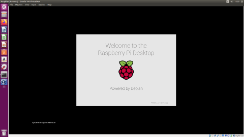

[Regresar](/Administracion-de-Sistemas-y-Servicios-en-Red/)

## TRABAJO AUTÓNOMO 1

### ADMINISTRACIÓN DE SISTEMAS OPERATIVOS BASADOS EN LINUX

**Objetivo de Aprendizaje:**  

Utilizar los sistemas operativos basados en Linux mediante una interfaz de administración que permita el manejo adecuado de los recursos y servicios.

**Recursos:** VirtualBox.

**Duración:** 6 horas

**INSTRUCCIONES**

+ El formato del trabajo tiene habilitado recuadros de color amarillo para que llenen las respuestas.
+ Los trabajos se reciben hasta la fecha planificada en el Aula Virtual.
+ Coloque el nombre del archivo así “ASSR_TAA_GrupoB_Apellido1_ApellidoN”, siendo A el número del trabajo, B el número del grupo, N el último apellido del integrante del grupo.
+ Una vez que haya desarrollado el trabajo, cada integrante del grupo contestará la encuesta de evaluación de los trabajos autónomos ingresando al enlace.  https://bit.ly/2UdUwrj

**INTRODUCCIÓN**

Un sistema operativo de red permite mantener a dos o más ordenadores unidos mediante algún medio de comunicación ya sea física o no, con el propósito de poder compartir recursos e información del sistema. En este entorno cada dispositivo mantiene su propio sistema operativo, así como su sistema de archivos local. Los sistemas operativos de red pueden dividirse en 2 grupos: aquellos que utilizan un modelo de cliente-servidor (Windows Server, Linux), y en los que no existe un servidor principal sino que utilizan un modelo entre iguales, en cual las estaciones comparten sus recursos de igual a igual. 

Uno de los principales sistemas operativos orientados a la proporción de servicios de red es Linux, el cual está basado en Unix. El kernel de Linux se encarga fundamentalmente de gestionar los recursos del equipo, establecer comunicación  con los diferentes dispositivos, gestionar programas en ejecución, administrar la memoria, así como también el acceso a los sistemas de almacenamiento y uso del microprocesador. Dado que se trata de un software libre, se ofrecen varias versiones bajo la licencia GLP, entre las principales distribuciones se encuentran: Ubuntu, Debian, Centos, Raspbian, etc.

GNS3 es un software utilizado globalmente para emular, configurar, probar y solucionar problemas de redes virtuales y reales. GNS3 le permite ejecutar una pequeña topología que consta de solo unos pocos dispositivos en su computadora portátil, a aquellos que tienen muchos dispositivos alojados en múltiples servidores o incluso alojados en la nube. 

**PROCEDIMIENTO**

En el presente trabajo realizará la instalación de los sistemas operativos basados en linux en un entorno virtualizado para formar una red de datos.

**ACTIVIDADES**

1.	Instale el software de virtualización de elección. Puede usar VirtualBox o VMware para esto.
2.	Descargue el sistema operativo de su elección. Para esto debe escoger una distribución basada en Linux que NO sea CentOS. Un ejemplo de una distribución ligera de Linux puede ser el sistema operativo de Raspberry Pi.
3.	Inicie el software de virtualización escogido y cree una nueva máquina. Debe escoger de tipo Linux y en la versión debe corresponder a la distribución escogida en el anterior paso (Fedora, Debian, etc.).
4.	Seleccione las características de procesamiento de tu computadora virtual. Dentro de esto deberá escoger el tamaño de memoria RAM destinada a la máquina virtual, así mismo, el tamaño del disco duro. Debe tomar en cuenta que los tamaños asignados a su máquina virtual, tanto disco duro como memoria RAM, serán restados a su computadora física. Recomendación 40GB de disco duro 4GB RAM.

Figura 1. Creación de la máquina virtual en VirtualBox.

  

Figura 2. Proceso de instalación de Raspbian.

  

Figura 3. Inicialización de Raspbian.

  

