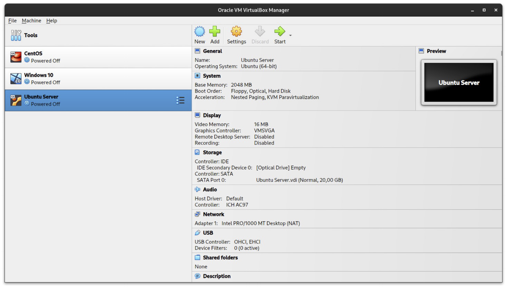
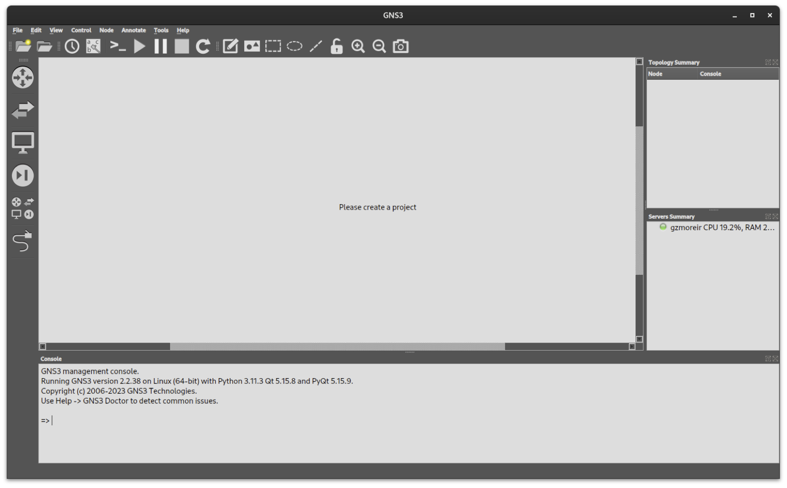
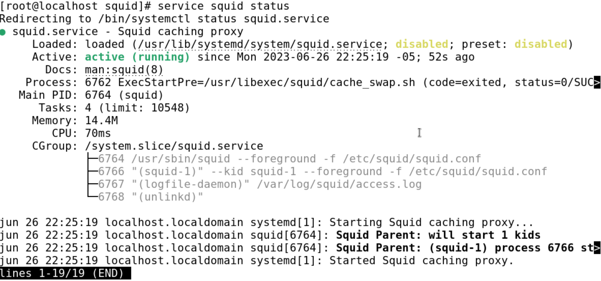

[Regresar](/Administracion-de-Sistemas-y-Servicios-en-Red/)

## Trabajo Autónomo 2
## Automatización de la administración de un servidor Linux

## 🎯 Objetivo de Aprendizaje 
Al finalizar la clase el estudiante será capaz de:
- Utilizar los sistemas operativos basados en Linux mediante una interfaz de administración que permita el manejo adecuado de los recursos y servicios.

**Introducción**
Squid es un proxy de caché para la Web compatible con HTTP, HTTPS, FTP y más. Reduce el ancho de banda y mejora los tiempos de respuesta almacenando en caché y reutilizando las páginas web más solicitadas. Squid dispone de amplios controles de acceso y es un excelente acelerador de servidores. Funciona en la mayoría de los sistemas operativos disponibles, incluido Windows, y tiene licencia GNU GPL.

**Instrucciones**
El formato del trabajo tiene habilitado recuadros de color amarillo para que llenen las respuestas.
Los trabajos se reciben hasta la fecha planificada en el Aula Virtual.
Coloque el nombre del archivo así “ASSR_TAA_GrupoB_Apellido1_ApellidoN”, siendo A el número del trabajo, B el número del grupo, N el último apellido del integrante del grupo.
Una vez que haya desarrollado el trabajo, cada integrante del grupo contestará la encuesta de evaluación de los trabajos autónomos ingresando al enlace https://bit.ly/2UdUwrj

**Actividades**
La empresa Adita S.A. tiene un único servidor que contiene servicios de proxy. Debido a una falla eléctrica el servidor presente errores en el disco duro por lo cual el personal del área de infraestructura decide iniciar el proyecto de creación de una granja de servidores independientes para el servicio de proxy. Considerando lo mencionado, han contratado a un grupo de ingenieros especializados para que realicen las siguientes actividades:


## Actividad 1: Instalación

### Paso 1. Creación de Máquinas virtuales
Para este trabajo autónomo se hará uso de tres máquinas virtuales. Se usará una máquina virtual con Windows 10, una máquina virtual con CentOS, y finalmente, una máquina virtual que ejecute Ubuntu Server.
Este paso consta en replicar lo aprendido en el trabajo autónomo 1, creando así las máquinas virtuales pedidas en el párrafo anterior.

<p align="center">
  
</p>

	
### Paso 2. Instalación de GNS3

GNS3 es un software de simulación que permite crear y testear redes virtuales. Este software permite importar routers, switches, firewalls, servidores, etc. A diferencia de otros programas similares, como lo puede ser Cisco Packet Tracer, GNS3 permite importar imágenes reales de los dispositivos antes mencionados, haciendo así que el uso de este simulador sea mucho más parecido a la realidad al momento de trabajar con los equipos, de la misma manera, no presenta las limitaciones que otros presentan.

Instalación: Para la instalación del simulador, use la [página oficial de descargas de GNS3](https://gns3.com/software/download). Descargue el archivo de programa y siga la guía de instalación oficial de acuerdo a su sistema operativo.

<p align="center">
  
</p>


## Actividad 2: Configuración de proxy transparente

### Paso 1. Creación de la topología

### Paso 2. Instalación y configuración de Squid en CentOS

En este paso, se debe realizar la instalación del paquete de Squid en la máquina virtual de CentOS. Squid es un proxy de cacheo que reduce el ancho de banda y que mejora los tiempos de respuesta de las páginas web. 

En este trabajo autónomo se deberá instalar el paquete en la máquina virtual como se mencionó anteriormente. Una vez que el paquete se encuentre instalado, se deberá realizar la configuración del mismo para que este actúe como un proxy transparente que permita a las otras dos máquinas virtuales restantes conectarse a Internet.


### Paso 3. Instalar el paquete squid usando el repositorio yum

```
[root@localhost acollaguazo]# yum -y install squid
CentOS Stream 9 - BaseOS                      29 kB/s |  19 kB     00:00    
CentOS Stream 9 - AppStream                   27 kB/s |  19 kB     00:00    
CentOS Stream 9 - Extras packages             26 kB/s |  22 kB     00:00    
Dependencias resueltas.
=============================================================================
 Paquete               Arquitectura Versión             Repositorio     Tam.
=============================================================================
Instalando:
 squid                 aarch64      7:5.5-5.el9         appstream      3.9 M
Instalando dependencias:
 httpd-filesystem      noarch       2.4.57-2.el9        appstream       15 k
 libecap               aarch64      1.0.1-10.el9        appstream       26 k
 perl-English          noarch       1.11-480.el9        appstream       15 k

Resumen de la transacción
=============================================================================
Instalar  4 Paquetes

Tamaño total de la descarga: 3.9 M
Tamaño instalado: 12 M
Descargando paquetes:
(1/4): perl-English-1.11-480.el9.noarch.rpm   18 kB/s |  15 kB     00:00    
(2/4): httpd-filesystem-2.4.57-2.el9.noarch.  18 kB/s |  15 kB     00:00    
(3/4): libecap-1.0.1-10.el9.aarch64.rpm       28 kB/s |  26 kB     00:00    
(4/4): squid-5.5-5.el9.aarch64.rpm           618 kB/s | 3.9 MB     00:06    
-----------------------------------------------------------------------------
Total                                        486 kB/s | 3.9 MB     00:08     
CentOS Stream 9 - AppStream                  1.6 MB/s | 1.6 kB     00:00    
Importando llave GPG 0x8483C65D:
 ID usuario: "CentOS (CentOS Official Signing Key) <security@centos.org>"
 Huella    : 99DB 70FA E1D7 CE22 7FB6 4882 05B5 55B3 8483 C65D
 Desde     : /etc/pki/rpm-gpg/RPM-GPG-KEY-centosofficial
La llave ha sido importada exitosamente
Ejecutando verificación de operación
Verificación de operación exitosa.
Ejecutando prueba de operaciones
Prueba de operación exitosa.
Ejecutando operación
  Ejecutando scriptlet: squid-7:5.5-5.el9.aarch64                        1/1 
  Preparando          :                                                  1/1 
  Instalando          : perl-English-1.11-480.el9.noarch                 1/4 
  Instalando          : libecap-1.0.1-10.el9.aarch64                     2/4 
  Ejecutando scriptlet: httpd-filesystem-2.4.57-2.el9.noarch             3/4 
  Instalando          : httpd-filesystem-2.4.57-2.el9.noarch             3/4 
  Ejecutando scriptlet: squid-7:5.5-5.el9.aarch64                        4/4 
  Instalando          : squid-7:5.5-5.el9.aarch64                        4/4 
  Ejecutando scriptlet: squid-7:5.5-5.el9.aarch64                        4/4 
  Verificando         : httpd-filesystem-2.4.57-2.el9.noarch             1/4 
  Verificando         : libecap-1.0.1-10.el9.aarch64                     2/4 
  Verificando         : perl-English-1.11-480.el9.noarch                 3/4 
  Verificando         : squid-7:5.5-5.el9.aarch64                        4/4 
Productos instalados actualizados.

Instalado:
  httpd-filesystem-2.4.57-2.el9.noarch      libecap-1.0.1-10.el9.aarch64     
  perl-English-1.11-480.el9.noarch          squid-7:5.5-5.el9.aarch64        

¡Listo!
[root@localhost acollaguazo]#
```

## Paso 4. Configurar el servicio de proxy transparente en el archivo /etc/squid/squid.conf de acuerdo a los parámetros.

```
[root@srv1-linux adita]# cd /etc/squid/

[root@srv1-linux squid]# more squid.conf

Squid normally listens to port 3128**
http_port 3128

Uncomment and adjust the following to add a disk cache directory
#Configuraremos el espacio que tendrá nuestro cache. El valor 100, quiere decir que dispondremos de 100MB de #cache en nuestro disco, podemos aumentarlo si deseamos almacenar mas cache y usar menos ancho de banda, no 

#modificar los otros valores**
cache_dir ufs /var/spool/squid 100 16 256 

# Recommended minimum configuration:
# Example rule allowing access from your local networks.
# Adapt to list your (internal) IP networks from where browsing
# should be allowed
acl localnet src 0.0.0.1-0.255.255.255	# RFC 1122 "this" network (LAN)
acl localnet src 10.0.0.0/8		# RFC 1918 local private network (LAN)
acl localnet src 100.64.0.0/10		# RFC 6598 shared address space (CGN)
acl localnet src 169.254.0.0/16 	# RFC 3927 link-local (directly plugged) machines
acl localnet src 172.16.0.0/12		# RFC 1918 local private network (LAN)
acl localnet src 192.168.0.0/16		# RFC 1918 local private network (LAN)
acl localnet src fc00::/7       	# RFC 4193 local private network range
acl localnet src fe80::/10      	# RFC 4291 link-local (directly plugged) machines


# Example rule allowing access from your local networks.
# Adapt localnet in the ACL section to list your (internal) IP networks
# from where browsing should be allowed
http_access allow localnet   #Permitir el tráfico de la red interna

```

### Paso 4. Activar el servicio squid.

```
[root@localhost squid]# service squid restart
Redirecting to /bin/systemctl restart squid.service
```

### Paso 5. Luego verificar que el estado del squid este activo.
<p align="center">
  
</p>

### Paso 6. Crear el espacio swap.

```
[root@localhost squid]# squid -z
2023/06/26 22:29:15| FATAL: Squid is already running: Found fresh instance PID file (/run/squid.pid) with PID 6764
    exception location: Instance.cc(121) ThrowIfAlreadyRunningWith
```


### Paso 7. Verificar que el protocolo y puerto del squid operativo.

```
[root@localhost squid]# netstat -nl
Active Internet connections (only servers)
Proto Recv-Q Send-Q Local Address           Foreign Address         State      
tcp        0      0 0.0.0.0:22              0.0.0.0:*               LISTEN     
tcp        0      0 127.0.0.1:631           0.0.0.0:*               LISTEN     
tcp6       0      0 :::22                   :::*                    LISTEN     
tcp6       0      0 :::3128                 :::*                    LISTEN     
tcp6       0      0 ::1:631                 :::*                    LISTEN     
udp        0      0 0.0.0.0:38911           0.0.0.0:*                          
udp        0      0 0.0.0.0:5353            0.0.0.0:*                          
udp        0      0 127.0.0.1:323           0.0.0.0:*                          
udp        0      0 0.0.0.0:47663           0.0.0.0:*                          
udp6       0      0 :::47929                :::*                               
udp6       0      0 :::5353                 :::*                               
udp6       0      0 ::1:323                 :::*                               
udp6       0      0 :::58934                :::*                               
raw6       0      0 :::58                   :::*                    7          
Active UNIX domain sockets (only servers)
```

### Paso 8. Instalar el paquete de filtrado de paquetes iptables para proporcionar seguridad al squid.

```
[root@localhost firewalld]# dnf install iptables-services
Error al cargar el complemento "config_manager": '*prog'
Actualización de repositorios de Subscription Management.
No se pudo leer identidad del consumidor

This system is not registered with an entitlement server. You can use subscription-manager to register.

Última comprobación de caducidad de metadatos hecha hace 0:22:31, el lun 26 jun 2023 22:26:08.
Dependencias resueltas.
===========================================================================================
 Paquete                       Arquitectura   Versión              Repositorio        Tam.
===========================================================================================
Instalando:
 iptables-nft-services         noarch         1.8.8-6.el9          appstream          23 k

Resumen de la transacción
===========================================================================================
Instalar  1 Paquete

Tamaño total de la descarga: 23 k
Tamaño instalado: 30 k
¿Está de acuerdo [s/N]?: s
Descargando paquetes:
iptables-nft-services-1.8.8-6.el9.noarch.rpm                27 kB/s |  23 kB     00:00    
-------------------------------------------------------------------------------------------
Total                                                       11 kB/s |  23 kB     00:02     
Ejecutando verificación de operación
Verificación de operación exitosa.
Ejecutando prueba de operaciones
Prueba de operación exitosa.
Ejecutando operación
  Preparando          :                                                                1/1 
  Instalando          : iptables-nft-services-1.8.8-6.el9.noarch                       1/1 
  Ejecutando scriptlet: iptables-nft-services-1.8.8-6.el9.noarch                       1/1 
  Verificando         : iptables-nft-services-1.8.8-6.el9.noarch                       1/1 
Productos instalados actualizados.

Instalado:
  iptables-nft-services-1.8.8-6.el9.noarch                                            
¡Listo!
```

### Paso 9. Configurar en el archivo /etc/firewalld/rules.sh un script para habilitar reglas de firewall, que permiten la activación del acceso a internet desde la red interna y el uso de proxy transparente.

```
[root@localhost squid]# cd /etc/firewalld/

[root@localhost firewalld]# ll
total 8
-rw-r--r--. 1 root root 2483 dic 13  2022 firewalld.conf
drwxr-x---. 2 root root    6 dic 13  2022 helpers
drwxr-x---. 2 root root    6 dic 13  2022 icmptypes
drwxr-x---. 2 root root    6 dic 13  2022 ipsets
-rw-r--r--. 1 root root  271 dic 13  2022 lockdown-whitelist.xml
drwxr-x---. 2 root root    6 dic 13  2022 policies
drwxr-x---. 2 root root    6 dic 13  2022 services
drwxr-x---. 2 root root   46 may 27 15:46 zones

[root@localhost firewalld]# chmod 777 rules.sh

[root@localhost firewalld]# vi rules.sh
#!/bin/bash
############################################
# DESARROLLADOR: ADRIANA COLLAGUAZO        #
# FECHA: 26-06-2023                        #
############################################
IPT=/sbin/iptables
WAN_IFACE=ens160
WAN_NET=10.0.2.0
WAN_MASK=255.255.255.0
WAN_RANGE=$WAN_NET/$WAN_MASK

LAN_IFACE=enp0s8
LAN_NET=192.168.7.0
LAN_MASK=255.255.255.0
LAN_RANGE=$LAN_NET/$LAN_MASK

echo -e "Cargando reglas para el servidor ... OK!!!"
#Enmascaramiento para navegacion
$IPT -t nat -A POSTROUTING -o $WAN_IFACE -s $LAN_RANGE -j MASQUERADE
$IPT -A FORWARD -m state --state ESTABLISHED,RELATED -j ACCEPT
#Proxy transparente
$IPT -t nat -A PREROUTING -i $LAN_IFACE -s $LAN_RANGE -p tcp --dport 80 -j REDIRECT --to-port 3128

```


### Paso 10. Ejecutar las reglas de firewall.

```
[root@localhost firewalld]# ./rules.sh 
Cargando reglas para el servidor ... OK!!!
```


### Paso 11. Verificar las reglas de iptables en las tablas filter y nat.

```
[root@localhost firewalld]# iptables -nL -t nat
Chain PREROUTING (policy ACCEPT)
target     prot opt source               destination         
REDIRECT   tcp  --  192.168.7.0/24       0.0.0.0/0            tcp dpt:80 redir ports 3128

Chain INPUT (policy ACCEPT)
target     prot opt source               destination         

Chain OUTPUT (policy ACCEPT)
target     prot opt source               destination         

Chain POSTROUTING (policy ACCEPT)
target     prot opt source               destination         
MASQUERADE  all  --  192.168.7.0/24       0.0.0.0/0        

      
[root@localhost firewalld]# iptables -nL -t filter
Chain INPUT (policy ACCEPT)
target     prot opt source               destination         

Chain FORWARD (policy ACCEPT)
target     prot opt source               destination         
ACCEPT     all  --  0.0.0.0/0            0.0.0.0/0            state RELATED,ESTABLISHED

Chain OUTPUT (policy ACCEPT)
target     prot opt source               destination         
```

### Paso 12. Activar el servicio de iptables.

```
[root@localhost firewalld]# systemctl start iptables
```

### Paso 13. Verificar el estado activo del servicio de iptables.

<p align="center">
  
</p>
