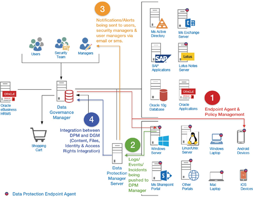
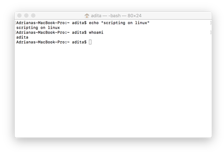
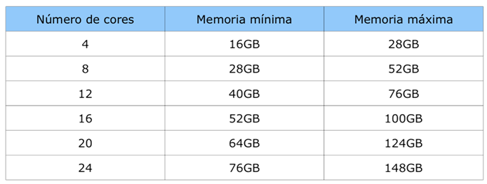
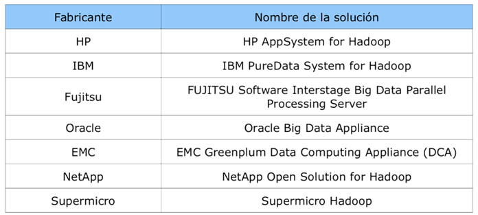
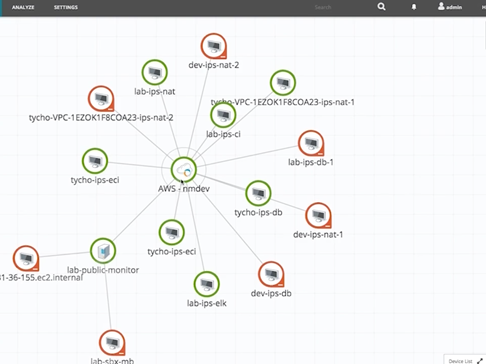
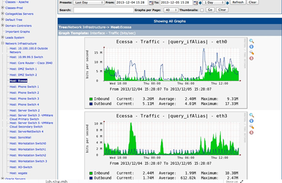
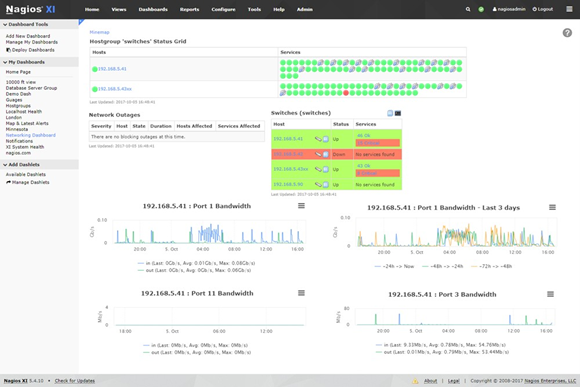
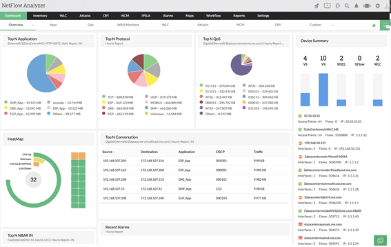
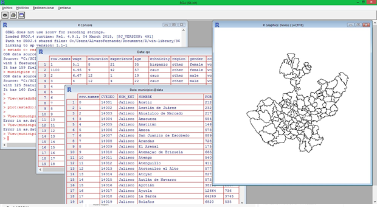
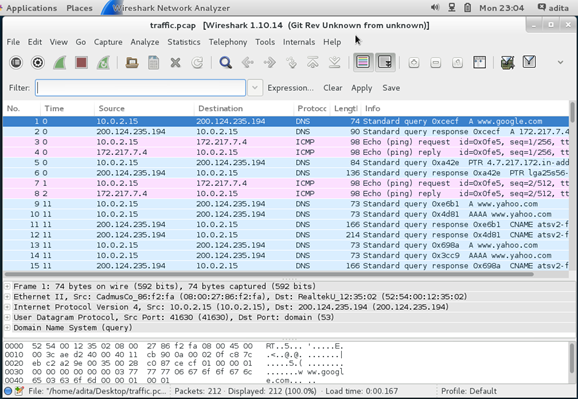

[Regresar](/Administracion-de-Sistemas-y-Servicios-en-Red/)

## 💻 **Servicios para Análisis de Datos**

Un buen proveedor de almacenamiento de datos debería
ofrecerle una infraestructura en la que ejecutar todas sus  herramientas de análisis de datos, así como un lugar para  almacenar y consultar sus datos, por ejemplo: logs del sistema,  porcentaje de utilización del CPU, uso de la memoria RAM.

**La ciencia de datos según los siguientes cinco pasos:**
1. obtención de datos usando MySQL, leyendo sensores.
2. depuración de datos, usando líneas de filtrado, extrayendo  palabras, convertiendo datos de un formato a otro.
3. exploración de datos, para la obtención de estadísticas.
4. datos de modelado, para explicar los datos o predecir lo  que sucederá.
5. interpretación de datos, para obtener conclusiones, evaluar lo que significan sus resultados.

<p align="center">
  
</p>

### 💻 **Línea de Comandos**

La primera ventaja de la línea de comando es que te permite ser ágil. La ciencia de los datos  tiene una naturaleza muy interactiva y exploratoria, y el entorno en el que trabajas debe  permitirlo.

Primero, la línea de comando proporciona un llamado read-eval-print-loop (REPL). Esto significa  que ingresa un comando, presiona y el comando se evalúa inmediatamente. Un REPL es a  menudo mucho más conveniente para hacer ciencia de datos que el ciclo de edición-  compilación-ejecución-depuración asociado con scripts, grandes programas y, por ejemplo,  trabajos de Hadoop. En segundo lugar, la línea de comando está muy cerca del sistema de  archivos. Debido a que los datos son el ingrediente principal para hacer ciencia de datos, es  importante poder trabajar fácilmente con los archivos que contienen su conjunto de datos. La  línea de comando ofrece muchas herramientas convenientes para esto.

Cualquier tecnología que su flujo de trabajo de ciencia de datos incluya actualmente, ya sea R,  IPython o Hadoop. En cambio, la línea de comando se presenta como una tecnología de  aumento que amplifica las tecnologías que está empleando actualmente.

Debido a que la línea de comando viene con cualquier sistema operativo similar a Unix,  incluidos Ubuntu Linux y macOS, se puede encontrar en muchos lugares. Según un artículo sobre  los sitios de supercomputación top 500, el 95% de los 500 supercomputadores principales  están ejecutando GNU / Linux.

<p align="center">
  
</p>

### **Archivos en formato CSV**

**Archivo CSV:** Los archivos CSV (del inglés comma-separated values) son un tipo de documento en formato  abierto sencillo para representar datos en forma de tabla, en las que las columnas se separan por comas.

<p align="center">
  
</p>

### **Recursos de Hardware**

Los cálculos Big Data raramente están limitados por la CPU, en general están limitados por la E/S a disco y a la red. En general se  recomienda una configuración de memoria considerando los nodos utilizados:
**Memoria mínima (GB) = 1.5 x <num cores cpu> x 2 + 4**

<p align="center">
  
</p>

+ Es preferible una configuración de + los nodos con 8 discos de 1TB.
Los nodos deben disponer al menos de conectividad Gbit, siendo recomendable que dispongan de varias conexiones de 1Gbit o de una  conexión 10GBit. Teniendo en cuenta el elevado coste de las conexiones 10Gbit puede ser más adecuado utilizar 4 conexiones de 1Gbit.
+ Se recomienda utilizar switches dedicados para la plataforma.

### **Recursos de Hardware**

Dentro de sus porfolios de productos muchos fabricantes incluyen soluciones específicas para el manejo de  gran volúmenes de datos, como se muestra en la siguiente tabla:

<p align="center">
  
</p>

### **Recursos de Software**

+ **Hadoop:** es un framework opensource para almacenar datos y  ejecutar aplicaciones en clusters de hardware básicos.  Proporciona un almacenamiento masivo para cualquier tipo de  datos, un enorme poder de procesamiento y la capacidad de  manejar tareas o trabajos prácticamente ilimitados.
+ **Pandas:** cuenta con herramientas para estructuras de datos y
análisis basadas en el lenguaje de programación Python.
+ **Blazegraph:** Antes conocida como Bigdata. Es una base de datos  altamente escalable y de gran performance. Se puede obtener  bajo licencia open source o comercial. Es independiente del  sistema operativo.
+ **R:** Es un lenguaje de programación que fue diseñado para  manejar estadísticas y gráficos. Incluye una suite integrada de
herramientas	para	Big	Data	para	manipulación,	cálculo	y  visualización. Corre sobre Windows, Linux y macOS.

<p align="center">
  
</p>

## **Monitoreo de la Red**

**WhatsUp Gold** tiene una gran cantidad de mejoras  impulsadas por el usuario que  le permiten  monitorear proactivamente más de lo que importa y  brindarle visibilidad instantánea del estado de su  entorno de red.
WhatsUp Gold  descubre, asigna y monitorea  automáticamente los entornos en la nube, que  incluyen Amazon Web Services y los servidores  Azure. Puede monitorear, informar y alertar sobre  el estado y el rendimiento de cada métrica que su  servicio en la nube recopila mediante su propia API  nativa.

<p align="center">
  
</p>

### **SNMP**

**Cacti** es una interfaz completa para “Round Robin Database  Tool” (RRDTool), almacena toda la información necesaria para  crear gráficos y llenarlos con datos en una base de datos  MySQL. La interfaz está completamente dirigida por PHP.  Además de ser capaz de mantener gráficos, fuentes de datos y  archivos Round Robin en una base de datos, Cacti maneja la  recolección de datos. También hay soporte SNMP para aquellos  que se utilizan para crear gráficos de tráfico con MRTG.
Debido a las muchas funciones de cacti, una herramienta de
administración basada en el usuario está integrada para que  pueda agregar usuarios y otorgarles derechos a ciertas áreas  de cacti. Esto permitiría a alguien crear algunos usuarios que  pueden cambiar los parámetros del gráfico, mientras que otros  solo pueden ver los gráficos. Cada usuario también mantiene su  propia configuración cuando se trata de ver gráficos.
Contiene un mecanismo de "entrada de datos" que permite a los
usuarios definir scripts personalizados que se pueden usar para  recopilar datos. Cada secuencia de comandos puede contener  argumentos que deben ingresarse para cada fuente de datos  creada con la secuencia de comandos (como una dirección IP).
[root@localhost Desktop]# yum install cacti

<p align="center">
  
</p>

Management Protocol” es una colección de estaciones de  administración de red y elementos de red.


aplicaciones	de	administración	que	monitorean	y  controlan los elementos de la red.
La estrategia implícita en el SNMP es que la supervisión
del	estado	de	la	red	en	cualquier	nivel	de	detalle
significativo.
Un número limitado de mensajes no solicitados (trampas)  guían el tiempo y el enfoque del sondeo.
La limitación del número de mensajes no solicitados es
coherente con el objetivo de simplificar y minimizar la
cantidad de tráfico generado por la función de gestión  de red.

<p align="center">
  
</p>

### **Netflow**

+ NetFlow es una herramienta de análisis  de tráfico, aprovecha las tecnologías de  flujo para proporcionar visibilidad en  tiempo real del rendimiento del ancho de  banda de la red.

+ Principalmente una herramienta de monitoreo de ancho de banda, que  ofrece una visión holística sobre el ancho  de banda de su red y los patrones de  tráfico.

<p align="center">
  
</p>

### **Lenguaje R**

**R** proporciona un amplio grupo de herramientas estadísticas (modelos lineales y no lineales, tests estadísticos, análisis  de series temporales, algoritmos de clasificación y agrupamiento, etc.) y gráficas. Además, R puede integrarse con  distintas bases de datos y existen bibliotecas que facilitan su utilización desde lenguajes de programación  interpretados como Perl y Python.

<p align="center">
  
</p>

### **Comando PING con tamaño de paquetes**

```
root@debian:/home/sdn# ping 192.168.7.3 -c 25 -s 10000
PING 192.168.7.3 (192.168.7.3) 10000(10028) bytes of data.
10008 bytes from 192.168.7.3: icmp_seq=1 ttl=64 time=41.9 ms  10008 bytes from 192.168.7.3: icmp_seq=2 ttl=64 time=9.21 ms  10008 bytes from 192.168.7.3: icmp_seq=3 ttl=64 time=5.81 ms  10008 bytes from 192.168.7.3: icmp_seq=4 ttl=64 time=5.58 ms  10008 bytes from 192.168.7.3: icmp_seq=5 ttl=64 time=5.44 ms  10008 bytes from 192.168.7.3: icmp_seq=6 ttl=64 time=5.51 ms  10008 bytes from 192.168.7.3: icmp_seq=7 ttl=64 time=6.92 ms  10008 bytes from 192.168.7.3: icmp_seq=8 ttl=64 time=6.07 ms  10008 bytes from 192.168.7.3: icmp_seq=9 ttl=64 time=5.61 ms  10008 bytes from 192.168.7.3: icmp_seq=10 ttl=64 time=5.82 ms  10008 bytes from 192.168.7.3: icmp_seq=11 ttl=64 time=5.58 ms  10008 bytes from 192.168.7.3: icmp_seq=12 ttl=64 time=6.47 ms  10008 bytes from 192.168.7.3: icmp_seq=13 ttl=64 time=5.46 ms  10008 bytes from 192.168.7.3: icmp_seq=14 ttl=64 time=5.18 ms  10008 bytes from 192.168.7.3: icmp_seq=15 ttl=64 time=5.81 ms  10008 bytes from 192.168.7.3: icmp_seq=16 ttl=64 time=8.11 ms  10008 bytes from 192.168.7.3: icmp_seq=17 ttl=64 time=6.47 ms  10008 bytes from 192.168.7.3: icmp_seq=18 ttl=64 time=5.59 ms  10008 bytes from 192.168.7.3: icmp_seq=19 ttl=64 time=5.73 ms  10008 bytes from 192.168.7.3: icmp_seq=20 ttl=64 time=5.53 ms  10008 bytes from 192.168.7.3: icmp_seq=21 ttl=64 time=5.50 ms  10008 bytes from 192.168.7.3: icmp_seq=22 ttl=64 time=5.80 ms  10008 bytes from 192.168.7.3: icmp_seq=23 ttl=64 time=5.84 ms  10008 bytes from 192.168.7.3: icmp_seq=24 ttl=64 time=5.10 ms  10008 bytes from 192.168.7.3: icmp_seq=25 ttl=64 time=5.71 ms
--- 192.168.7.3 ping statistics ---
25 packets transmitted, 25 received, 0% packet loss, time 24049ms
rtt min/avg/max/mdev = 5.104/7.437/41.990/7.109 ms
```
### **Comando IPERF**


```
root@debian:/home/sdn# iperf3 -c 192.168.7.3  Connecting to host 192.168.7.3, port 5201
[ 4] local 192.168.7.2 port 39606 connected to 192.168.7.3 port 5201
[ ID] Interval	Transfer	Bandwidth	Retr Cwnd

```

NO SE PUDO COPIAR ESOS CODIGOS DE LA DIAPOSITIVA 61

### **Comando TCPDUMP**

**tcpdump:** Imprime una descripción del contenido de los paquetes en una interfaz de red

<p align="center">
  
</p>

## **Recomendaciones de Estudio**

Lee el material proporcionado por la profesora.
Participa en clase en la resolución de los ejercicios.
Asiste a las ayudantías de docencia.
Investiga, aprende, se parte de la clase.


***“Aprende de las buenas actitudes de las personas, no te fijes en las malas actitudes”.***
Autor: Ángel Collaguazo 
