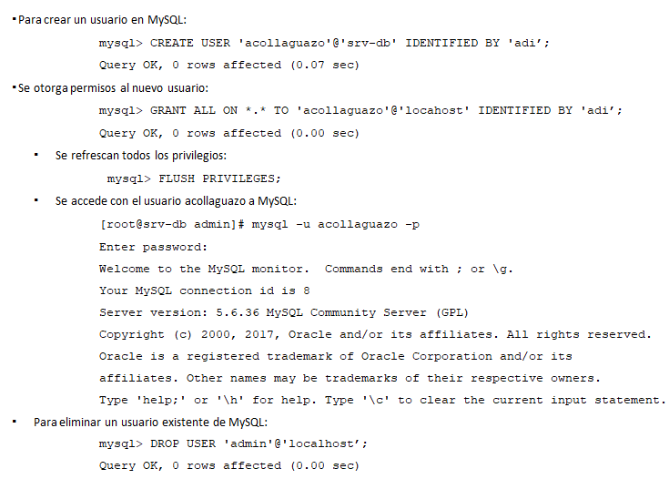

## MYSQL

+ MySQL es un sistema de gestión de bases de datos relacional desarrollado bajo licencia GPL/Licencia comercial por Oracle Corporation. 
+ MySQL está estructurado en un modelo cliente/servidor con un daemon de servidor (mysqld) que llena solicitudes de programas cliente. MySQL está diseñado para velocidad, confiabilidad y facilidad de uso. Se pretende que sea un sistema de gestión de bases de datos rápido para bases de datos grandes y, al mismo tiempo, fiable, adecuado para un uso intensivo.
+ Está considerada como la base datos open source más popular del mundo.

### Intalación

Para la instalación de MySQL se realizan los siguientes pasos:

  

### Inicio de Sesión

  

### Creación de usuarios en MYSQL

  

## Usando MSQLADMIN

Puede utilizar mysqladmin para realizar varias acciones:
Restaurar o mejorar la seguridad de la cuenta root.
Determinar el estado del servidor MySQL mientras está ejecutandose.
Apagar el servidor para actualización o reemplazos de componentes de hardware por emergencias.

**Ejemplos:**

[root@linux acollaguazo]# mysqladmin -u root -p password ‘clave’
[root@linux acollaguazo]# mysqladmin –p ping
[root@linux acollaguazo]# mysqladmin –p shutdown

## Recuperación de contraseña del usuario ROOT de MYSQL

  

### Creación de base de datos

Creación de una base de datos:

  

### Creación de tabla

Creación de tabla:

  

mostrar la tabla creada

  

### Ingreso de registros

Inserción de registros en la tabla:

  

### Modificación de tabla

El cambio de nombre de una tabla, como cualquier otro cambio en la estructura o meta información sobre una tabla, se logra mediante el comando ALTER.

  

## Modificando el tipo de datos de una columna

El cambio del tipo de datos de una columna también utiliza el comando ALTER, esta vez junto con la palabra clave MODIFY.

  

## Agregando una nueva columna

Supongamos que ha creado una tabla y la ha llenado con muchos datos, solo para descubrir que necesita una columna adicional. No es para preocuparse. A continuación, se muestra cómo agregar la nueva columna:

  

## Eliminando una columna
Para eliminar una columna use la palabra clave DROP:

  

## Modificando un registro

Esta construcción le permite actualizar el contenido de un campo. Si desea cambiar el contenido de uno o más campos, primero debe delimitar solo el campo o los campos que se van a modificar, de la misma manera que usa el comando SELECT.

  

## Eliminando un registro

    Cuando necesite eliminar una fila de una tabla, use el comando DELETE.

  

## QUERY USING THE WHERE, LIKE KEYWORDS

La palabra clave WHERE le permite restringir las consultas al devolver solo aquellas en las que cierta expresión es verdadera. También puede hacer una coincidencia de patrones para sus búsquedas usando el calificador LIKE, que permite búsquedas en partes de cadenas. Este calificador se debe usar con un carácter % antes o después de algún texto. Cuando se coloca antes de una palabra clave,% significa cualquier carácter.

  

## QUERY USING JOIN

+ Si desea especificar la columna en la que unir dos tablas, utilice el comando JOIN… ON:

  

## Respaldo y restauración de los datos

Con mysqldump, puede volcar una base de datos o una colección de bases de datos en uno o más archivos que contengan todas las instrucciones necesarias para volver a crear todas sus tablas y repoblarlas con sus datos. También puede generar archivos en CSV (valores separados por comas) y otros formatos de texto delimitados, o incluso en formato XML. Su principal inconveniente es que debe asegurarse de que nadie escriba sobre una tabla mientras la respalda.
Hay varias formas de hacerlo, pero lo más fácil es bajar el servicio de MySQL antes de mysqldump y reiniciar el servidor una vez que mysqldump termine.

[root@localhost admin]# mysqldump -u root –padi netlinux > netlinux.sql
Warning: Using a password on the command line interface can be insecure.

[root@localhost admin]# ls
menu.sh  netlinux.sql

## Respaldo y restauración de los datos

  

  

## Exportación de datos hacia un archivo CSV

Dado a que la información que se almacena en la base de datos es valiosa para la empresa, es importante realizar respaldos de la información períodicamente.

  

## Importación de datos desde un archivo CSV
Cuando un componente de hardware del servidor se ha dañado, el proceso de restauración de los datos y de la base de datos completa, es un tarea fácil de realizar cuando se cuenta con los archivos respaldados.

  

