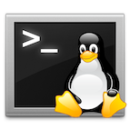
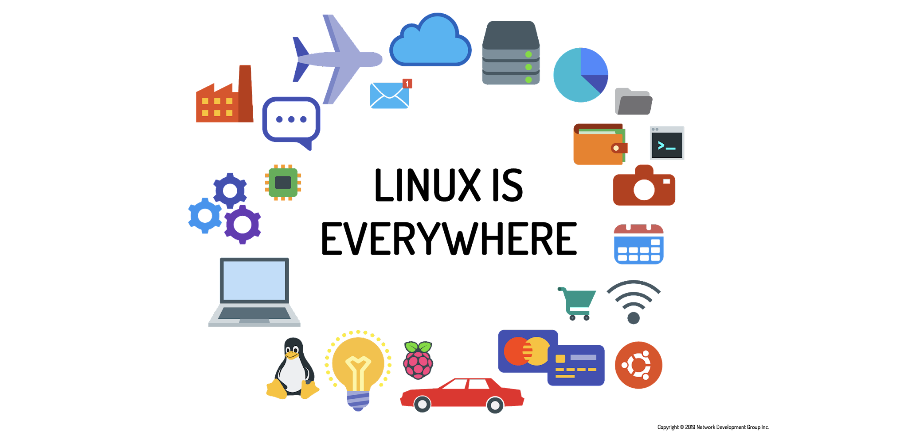
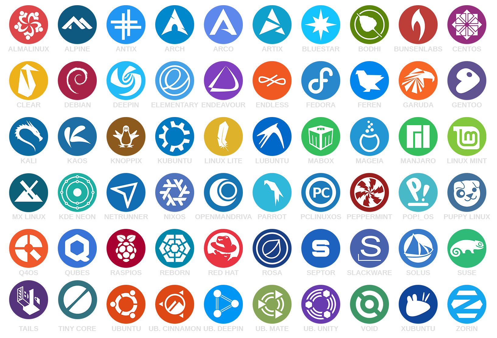

[Regresar](/Administracion-de-Sistemas-y-Servicios-en-Red/)

# Unidad 1: Internet y servicios en red

## 🎯 Objetivo de Aprendizaje
Al finalizar la clase el estudiante será capaz de:
- Utilizar los sistemas operativos basados en Linux mediante una interfaz de administración que permita el manejo adecuado de los recursos y servicios.

# 1.1. Distribuciones Linux
- [¿Qué es Linux?](#definicion)
    - [Linux en la industria](#industria)
    - [Linux es un kernel](#nucleo)
    - [Linux es open source](#open_source) 
    - [Linux usa CLI](#cli)
    - [Linux tiene distribuciones](#distribuciones)
        - [Red Hat]
        - [SUSE]
        - [Debian]
        - [Android]
        - [Otras distribuciones de Linux]
- [Referencias](#referencias)

## 💻 ¿Qué es Linux?

  

En 1983, *Richard Stallman* inició el Proyecto GNU, con el propósito de crear un sistema operativo similar y compatible con UNIX. 

En 1991, en Helsinki, *Linus Torvalds* comenzó un proyecto que más tarde llegaría a ser el núcleo Linux.

Las características que componen Linux incluyen lo siguiente:

- Detección y preparación del hardware
- Gestión de procesos
- Administración de memoria
- Proporcionar interfaces de usuario
- Control de sistemas de archivos
- Proporcionar acceso y autenticación de usuarios
- Ofreciendo utilidades administrativas
- Servicios de puesta en marcha
- Herramientas de programación

### 🕸️ **Linux en la industria**

  

Los trabajos de Linux están en todas partes, las habilidades de Linux están en demanda en casi todas las industrias y categorías de trabajo en el planeta.

VIDEO

### 🕸️ **Linux es un kernel**
Linux significa el *núcleo del sistema*, que es el controlador central de todo lo que sucede en la computadora.
Linux es una combinación de software llamado GNU/Linux, que define el sistema operativo.
- GNU es el software gratuito que proporciona equivalentes de código abierto de muchos comandos comunes de UNIX.
- La parte de Linux de esta combinación es el kernel de Linux, que es el núcleo del sistema operativo.

### 🕸️ **Linux es open-source**
Históricamente, la mayoría del software se ha emitido bajo una licencia de código cerrado.

Esto significa que tiene derecho a usar el programa ejecutable o el código de máquina, pero no puede ver el código fuente.

El desarrollo de Linux es muy similar al aumento del software de código abierto.

La filosofía de código abierto es que tiene derecho a obtener el código fuente del software y modificarlo para su propio uso.

### 🕸️ **Linux usa CLI**
Hay dos tipos básicos de interfaces disponibles que le permiten interactuar con el sistema operativo.

- El usuario típico de la computadora hoy está más familiarizado con una interfaz gráfica de usuario (GUI).
En una GUI, las aplicaciones se presentan en ventanas que pueden redimensionarse y moverse. Hay menús y herramientas para ayudar a los usuarios a navegar.

- El segundo tipo de interfaz es la interfaz de línea de comando (CLI), una interfaz basada en texto para la computadora.
La CLI se basa principalmente en la entrada del teclado.

    - La interfaz de línea de comando (CLI) es un sistema de entrada de texto simple para ingresar comandos de una sola palabra hasta scripts complicados.
    - En los sistemas que se inician en una GUI, hay dos formas comunes de acceder a la línea de comandos, un terminal basado en GUI y un terminal virtual:
        - Navegue a la aplicación Terminal desde el menú de aplicaciones.
        - Se puede ejecutar un terminal virtual al mismo tiempo que una GUI, pero puede requerir que el usuario inicie sesión a través del terminal virtual antes de poder ejecutar commandos.

### 🕸️ **Linux tiene distribuciones**

  

Una distribución se refiere al kernel de Linux, las herramientas y el conjunto de aplicaciones que se agrupan.

Tome Linux y las herramientas GNU, agregue algunas aplicaciones orientadas al usuario, como un navegador web y un cliente de correo electrónico, y tendrá un sistema Linux completo.

Casi todos los programas que son necesarios en un sistema GNU/Linux son de libre distribución y están disponibles en algún sitio de la red para su descarga, normalmente en forma de código fuente.

Hay distribuciones que se centran en la ejecución de servidores, equipos de escritorio o incluso herramientas específicas de la industria, como el diseño electrónico o la informática estadística.

Existen organizaciones comerciales que se dedican a empaquetar juntos los programas, incluirlos en algún medio como un CD, añadir un manual de instrucciones y proporcionar soporte técnico.

También existen distribuciones realizadas por voluntarios y que no tienen ánimo de lucro.

Las distribuciones modernas cuentan con:

- Un programa de instalación que guíe al usuario desde el principio e instale los paquetes básicos.
- Un gestor de paquetes que se encargue de proporcionar el interfaz necesario para que el administrador pueda instalar y desinstalar programas de una manera fácil.
- Un entorno gráfico (normalmente KDE o GNOME), con el que se integren el resto de los programas.
- Manuales de instalación y uso y documentación adicional sobre los programas. 
- Un sistema de seguimiento de errores (bugs) y fallos de seguridad que proporcione al usuario versiones corregidas de los programas lo más rápido posible cuando se detecte un fallo.

## 📚 Referencias
* Linux: The Complete Reference, Sixth Edition by Richard Petersen