[Regresar](/Administracion-de-Sistemas-y-Servicios-en-Red/)

# Unidad 1: Internet y servicios en red

# 🎯 Objetivo de Aprendizaje
Al finalizar la clase el estudiante será capaz de:
- Utilizar los sistemas operativos basados en Linux mediante una interfaz de administración que permita el manejo adecuado de los recursos y servicios.

## 1.3 Administración del sistema
- [Recursos computacionales para Linux](#recursos)
- [Tipos de Instalación](#instalacion)
- [Particiones en un disco duro](#particiones)
- [Herramientas de virtualización](#herramientas_virtualizacion)
- [Shell](#shell)
  - [Comandos](#comandos)
    - [Opciones](#opciones)
    - [Argumentos](#argumentos)
- [Historial](#historial)
- [Manual](#manual)
- [Búsqueda de comandos y documentación](#busqueda_comandos)
- [Búsqueda de archivos o directorios](#busqueda_archivos)
- [Documentación de información](#documentacion)
- [Opción de ayuda](#ayuda)
- [Estructura de directorios](#estructura)
  - [Directorio Home](#home)
  - [Directorio actual](#actual)
- [Cambiar directorios](#cambiar)
- [Rutas](rutas)
  - [Rutas absolutas](#absolutas)
  - [Rutas relativas](#relativas)
  - [Atajos](#atajos)
- [Crear directorios](#crear)
- [Eliminar directorios](#Eliminar)
- [Copiar archivos](#copiar)
- [Mover archivos](#mover)
- [Webmin](#webmin)
- [Administración de usuarios](#usuarios)
- [Grupo de Usuarios](#grupo_usuarios)
- [Referencias](#referencias)

<a name="recursos"> </a>
## 💻 Recursos computacionales para Linux
Previo a la instalación de una distribución de Linux para un servidor es necesario considerar los recursos básicos de hardware como sigue:

- CPU: Intel Celeron de 2.4 Ghz
 -Procesador: Pentium IV
- Disco duro: 40 GB
- Memoria: 4 GB
- Tarjetas de Red: 2 NICs PCI Realtek/basadas en chip Realtek o Via

<a name="instalacion"> </a>
## 💻 Tipos de Instalación
- Estación de trabajo: Más adecuada si es nuevo en el mundo de Linux y quiere probarlo. 
- Servidor: Si desea que su sistema funcione como un servidor basado en Linux utilizando servicios específicos.
- Portátil: Instalación sencilla en ordenadores portátiles. 
- Personalizada: Mayor flexibilidad en el proceso de instalación. Podrá elegir su esquema de particionamiento, los paquetes que desea instalar y mucho más. 
- Actualización: Para actualizar rápidamente a los últimos paquetes y versiones del kernel. 

<a name="particiones"> </a>
## 💻 Particiones en un disco duro
- Hay tres clases de particiones: primarias, extendidas y lógicas.
- Muchas distribuciones necesitan que se creen a mano las particiones de Linux utilizando el programa fdisk. Otras pueden crearlas automáticamente.
- En el primer sector del disco está el registro de arranque maestro “MBR” junto a la tabla de particiones.

<p align="center">
  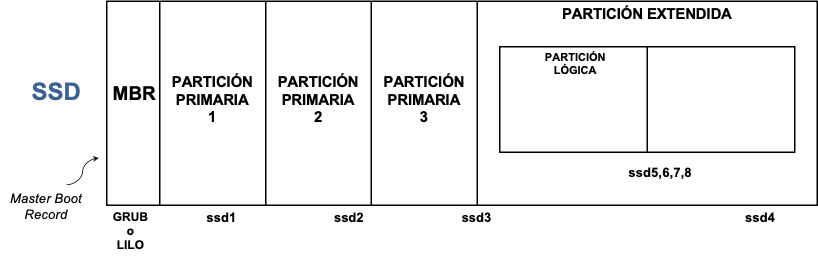
</p>

En Linux los manejadores, que se encuentran en el directorio /dev, se usan para comunicarse con los dispositivos de su sistema como discos duros. Los discos duros SSD se nombran con /dev/disksn.

<p align="center">
  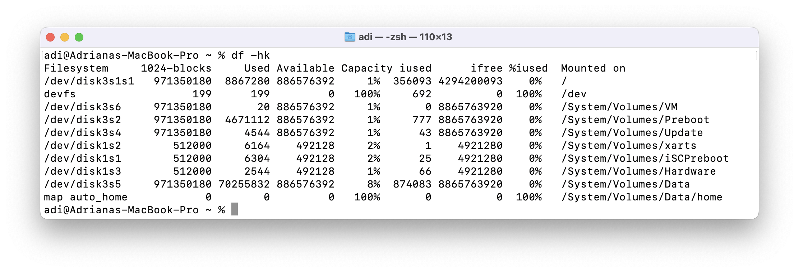
</p>

Por lo general se crean dos particiones para Linux, una para ser usada como sistema de ficheros raíz y la otra como espacio de intercambio “swap”.
La partición swap, es un espacio de intercambio de ayuda a la memoria RAM a pasar datos temporalmente al disco duro.

<p align="center">
  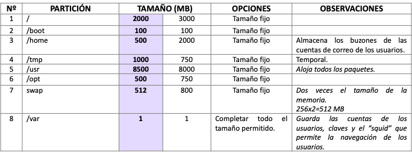
</p>

<a name="herramientas_virtualizacion"> </a>
## 💻 Herramientas de virtualización
- [VirtualBox](https://www.virtualbox.org)
- [Vmware](https://www.vmware.com)
- [Microsoft Azure](https://azure.microsoft.com/)
<p align="center">
  
</p>

<a name="referencias"> </a>
## 📚 Referencias
- VirtualBox from https://www.virtualbox.org
- Vmware from https://www.vmware.com
- Microsoft Azure from https://azure.microsoft.com/


<a name="shell"> </a>
## 💻 Shell
Cuando se ejecuta una aplicación de terminal y aparece un shell, que muestra una parte importante de la interfaz **el prompt**. 
Normalmente, el mensaje contiene información sobre el usuario y el sistema. A continuación se muestra una estructura de aviso común:

<p align="center">
  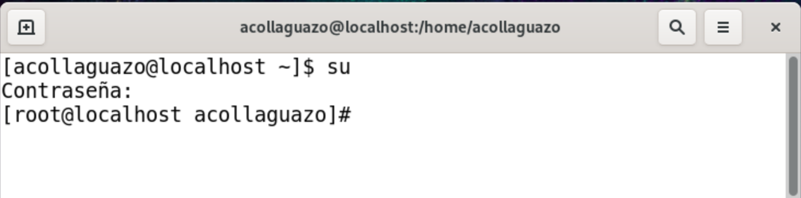
</p>

El prompt que se muestra, contiene la siguiente información:

Username ```acollaguazo```

Hostname ```localhost```

Current Directory ```~```


<a name="comandos"> </a>
## 💻 Comandos
- Un comando es un programa de software que, cuando se ejecuta en la CLI, realiza una acción en la computadora.

- Para ejecutar un comando, el primer paso es escribir el nombre del comando.

- Si usted escribe ```ls``` y presiona **Enter**. El resultado debería parecerse al siguiente ejemplo:

<p align="center">
  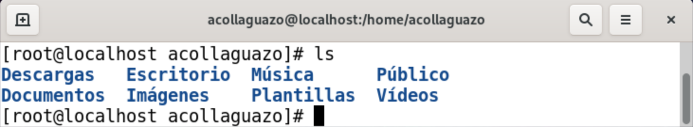
</p>

- Algunos comandos requieren una entrada adicional para ejecutarse correctamente.

- Esta entrada adicional viene en dos formas: opciones y argumentos.
  - Las opciones se utilizan para modificar el comportamiento central de un comando.
  - Los argumentos se utilizan para proporcionar información adicional (como un nombre de archivo o un nombre de usuario).

- El formato típico para un comando es el siguiente:

  ```comando [options] [arguments]```

<a name="opciones"> </a>
## 💻 Opciones

  comando [**options**] [arguments]

- Las opciones se pueden usar con Comandos para expandir o modificar el comportamiento de un comando.

- Por ejemplo, usando la opción ```-l``` del comando ```ls``` da como resultado una lista extensa, que proporciona información adicional sobre los archivos que se enumeran.

<p align="center">
  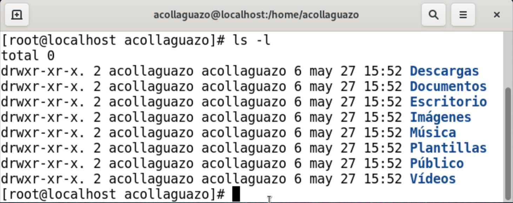
</p>


- A menudo, el caracter se elige la letra ***l*** para mostrar más información o ***r*** por reversa.

- Las opciones se pueden usar junto con otras opciones:  
<p align="center">
  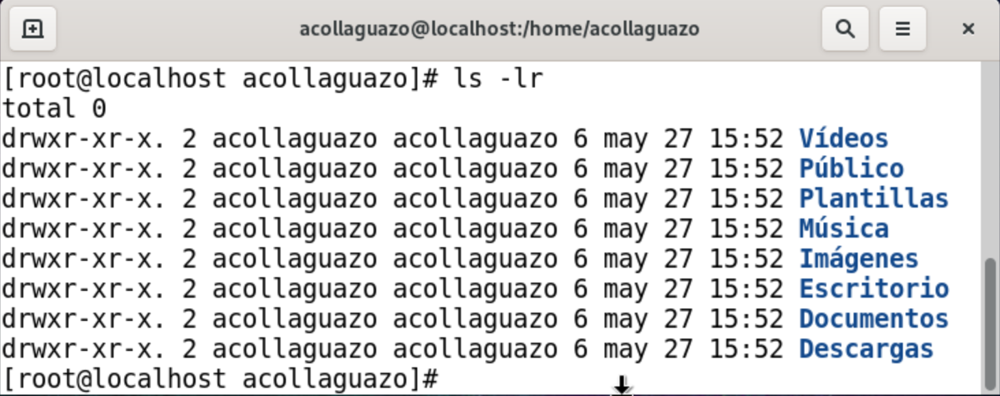
</p>
 
- Las opciones suelen ser letras simples; sin embargo, a veces también son palabras o frases.

- Por lo general, los ***comandos más antiguos*** usan letras simples, mientras que los comandos más nuevos usan palabras completas para las opciones ```-h```.

- Las opciones de palabras completas están precedidas por dos guiones ```--```, caracteres como la forma de palabras completas de la opción  ```-h```, la opción de ```--human-readable```. 

<a name="argumentos"> </a>
## 💻 Argumentos

  comando [options] [**arguments**]

- Se puede usar un argumento para especificar algo sobre lo que el comando debe actuar.

- Si el comando ```ls``` recibe el nombre de un directorio como argumento, enumera el contenido de ese directorio:

<p align="center">
  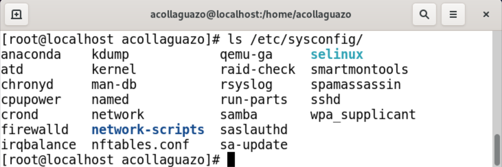
</p>

- Algunos comandos (como ```ls```) aceptan múltiples argumentos:

<p align="center">
  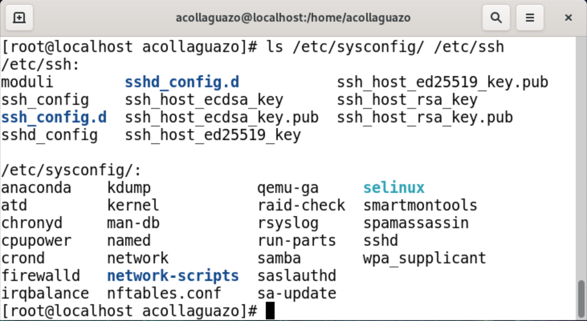
</p>

<a name="historial"> </a>
## 💻 Historial de comandos

- Cuando se ejecuta un comando en el terminal, se almacena en una lista de historial.
- Esto facilita la ejecución del mismo comando más tarde, eliminando la necesidad de volver a escribir todo el comando.
- Al presionar la tecla de flecha hacia arriba ```↑``` se muestra el comando anterior en la línea de solicitud.
- Para ver la lista de historial completa de una terminal, use el comando ```history```.

<p align="center">
  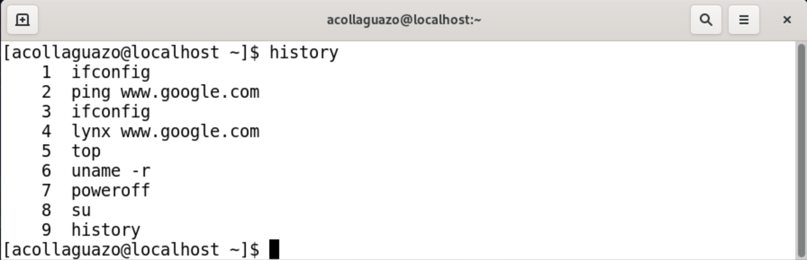
</p>

- Si el comando deseado está en la lista que genera el comando ```history```, se puede ejecutar escribiendo un signo de exclamación ! y luego el número al lado del comando (es decir,! 3) (i.e., ```!3```)

- Si el comando de historial pasa un número como argumento, genera ese número de comandos anteriores de la lista de historial, como se muestra:

<p align="center">
  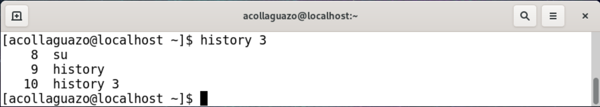
</p>

- Para ejecutar el tipo de comando más reciente ```!!``` y presiona Enter: 
- Para ejecutar la iteración más reciente de un comando específico, escriba ```!command``` y presione **Enter**.

<a name="manual"> </a>
## 💻 Manual

- Para ver una página del comando man, use el comando man:

```
man command
```

- Por ejemplo, a continuación se muestra la página del comando man ls:

<p align="center">
  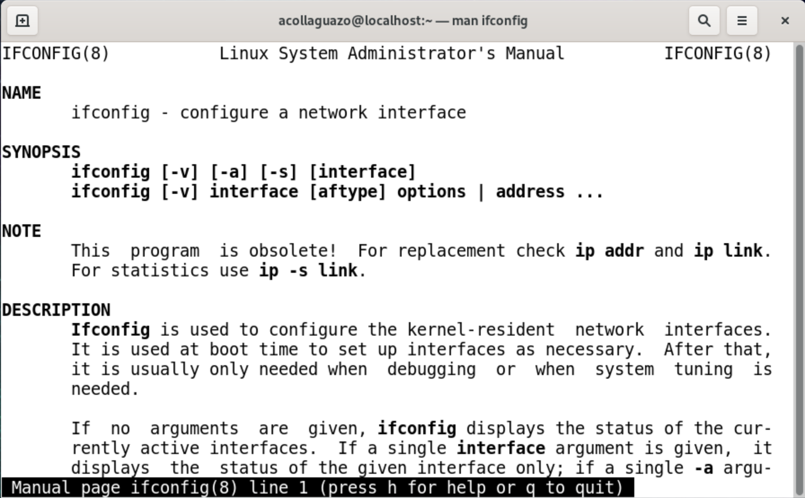
</p>

***Importante: El comando man usa un localizador para mostrar documentos. Por lo general, este localizador es el comando less, pero en algunas distribuciones, puede ser el comando more. Ambos son muy similares en su desempeño.***

- Navegue por el documento con las teclas de flecha:

- Para salir de ver una página de manual, use la tecla **Q**.


<a name="busqueda_comandos"> </a>
## 💻 Búsqueda de comandos y documentación

Para buscar la ubicación de un comando o las páginas del comando man, use el comando ```whereis```.

Este comando busca comandos, archivos de origen y páginas de manual en ubicaciones específicas donde estos archivos se almacenan normalmente:

<p align="center">
  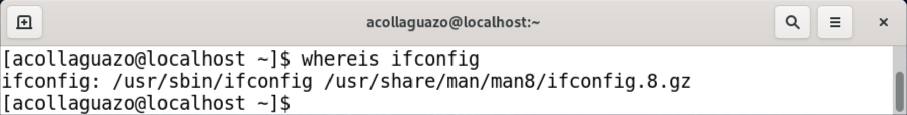
</p>

Las páginas de manual se distinguen fácilmente de los comandos, ya que generalmente se comprimen con un programa llamado ```gzip```, lo que da como resultado un nombre de archivo que termina en .gz.


<a name="busqueda_archivos"> </a>
## 💻 Búsqueda de archivos o directorios
- Para buscar cualquier archivo o directorio, use el comando locate.

- Este comando busca en una base de datos de todos los archivos y directorios que estaban en el sistema cuando se creó la base de datos.
Sin embargo, los archivos creados ese día no se podrán buscar con el comando de localizar porque la base de datos se actualiza todas las noches.
Es posible actualizar la base de datos de ```locate``` manualmente ejecutando el comando ```updatedb``` como root.

- El resultado puede ser bastante grande, por lo que puede ser útil utilizar las siguientes opciones:
La opción -c del comando ```locate``` mostrará cuántos archivos coinciden:

<p align="center">
  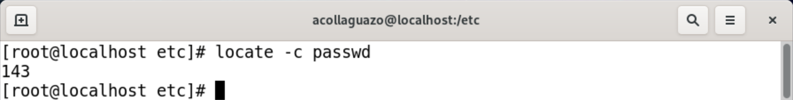
</p>

  - La opción -b solo incluye listados que tienen el término de búsqueda en el nombre base del nombre del archivo. Para limitar aún más la salida, coloque un caracter \ delante del término de búsqueda:

<p align="center">
  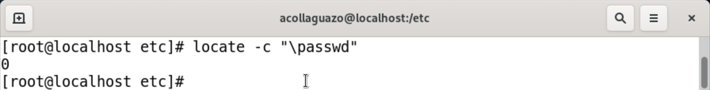
</p>


<a name="documentacion"> </a>
## 💻 Documentación de información

- Para mostrar la documentación de información de un comando, use el comando de información:

```
[acollaguazo@localhost ~]$ info dd
```

- Esta documentación se divide en nodos. En el ejemplo a continuación, la línea resaltada muestra que está actualmente en el nodo de invocación ls

<p align="center">
  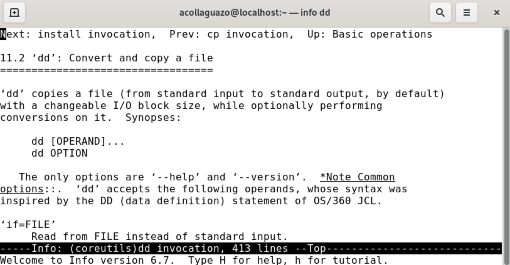
</p>

- Puede navegar por el documento con las teclas de flecha. 


<a name="ayuda"> </a>
## 💻 Opción de ayuda

Muchos comandos proporcionarán información básica, muy similar a la SINOPSIS que se encuentra en las páginas de manual, simplemente usando la opción --help para el comando.

<p align="center">
  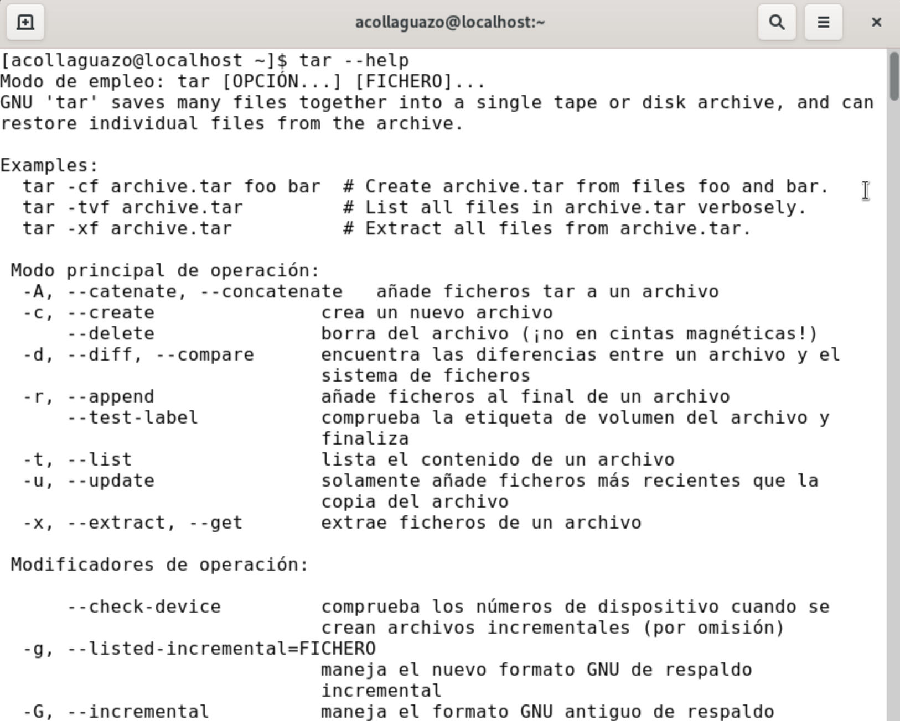
</p>


<a name="estructura"> </a>
## 💻 Estructura de directorios

- En un sistema Windows, el nivel superior de la estructura de directorios se llama Mi PC.

- La estructura de directorios de Linux, llamada sistema de archivos, también tiene un nivel superior llamado directorio raíz (simbolizado por la character slash **/**).

<p align="center">
  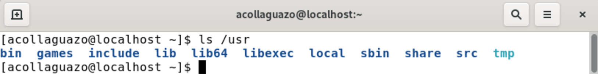
</p>

- Para ver el contenido del directorio root, use el comando ```ls``` con el caracter ```/``` como argumento:

<p align="center">
  
</p>

Observe que hay muchos directorios con nombres descriptivos que incluyen ```/boot```, que contiene archivos para iniciar la computadora.


<a name="home"> </a>

### 🕸️ Directorio Home

- En la mayoría de las distribuciones de Linux hay un directorio llamado home debajo del directorio root /.

- Debajo de este directorio ```/home``` hay un directorio para cada usuario en el sistema.

- Cuando un usuario abre un shell, debe colocarse automáticamente en su directorio de inicio.
  - El usuario tiene el control total para crear y eliminar archivos y directorios adicionales en su directorio de inicio.
  - La mayoría de los otros directorios en un sistema de archivos Linux están protegidos con permisos de archivo.

- El directorio home tiene un símbolo especial utilizado para representarlo, el caracter tilde ```~```.

- El nombre del directorio es el mismo que el nombre del usuario.

- Entonces, un usuario llamado ```acollaguazo``` tendría un directorio de inicio llamado ```/home/acollaguazo```:

<p align="center">
  
</p>


<a name="actual"> </a>
### 🕸️ Directorio actual

```
pwd [OPTIONS]
```

El comando ```pwd``` (directorio de trabajo de impresión) se puede utilizar para determinar dónde se encuentra actualmente el usuario dentro del sistema de archivos.

El comando ```pwd``` imprime el directorio de trabajo, que es la ubicación actual del usuario dentro del sistema de archivos.

<p align="center">
  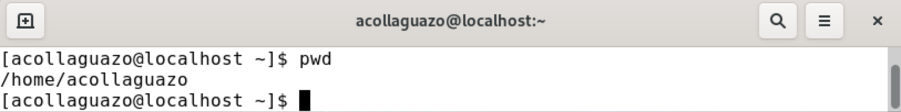
</p>


<a name="cambiar"> </a>
## 💻 Cambiar directorios

- Cuando un usuario abre un shell, generalmente comienza en su directorio home.

- Para navegar por el sistema de archivos, use el comando cd (cambiar directorio).

```
cd [options] [path]
```

- Para pasar del directorio actual al directorio Documentos, use el nombre del directorio como argumento para el comando ```cd```:

```
[acollaguazo@localhost ~]$ cd Descargas/
[acollaguazo@localhost Descargas]$
```

- Después de cambiar los directorios, la nueva ubicación también se puede confirmar en el nuevo prompt, que se muestra nuevamente en azul en la imagen anterior.


- Cuando se usa sin argumentos, el comando ```cd``` llevará al usuario a su directorio de inicio.

```
[acollaguazo@localhost Descargas]$ cd
[acollaguazo@localhost ~]$ 
```

- Si el usuario intenta cambiar a un directorio que no existe, el comando devuelve un mensaje de error:

```
[acollaguazo@localhost ~]$ cd acollaguazo
bash: cd: acollaguazo: No existe el fichero o el directorio
```


<a name="rutas"> </a>
## 💻 Rutas

Una ruta es una lista de directorios separados por el carácter ```/```.

Hay dos tipos de rutas: absolutas y relativas.

Por ejemplo, ```/home/acollaguazo``` es una ruta al directorio de inicio:

```
[acollaguazo@localhost /]$ ls
afs  boot  etc   lib    media  opt   root  sbin  sys  usr
bin  dev   home  lib64  mnt    proc  run   srv   tmp  var
```

<p align="center">
  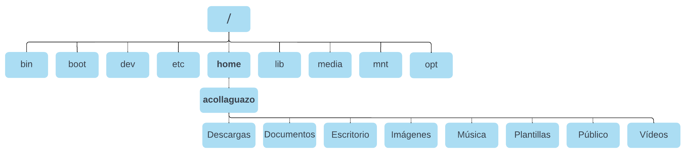
</p>


<a name="absolutas"> </a>
### 🕸️ Rutas absolutas

- Las rutas absolutas permiten al usuario especificar la ubicación exacta de un directorio.

- Las rutas absolutas siempre comienzan en el directorio root y, por lo tanto, siempre comienzan con el carácter ```/```.

- La ruta ```/home/sysadmin``` es una ruta absoluta; le dice al sistema que:
  - Comience en el directorio root / > muévase al directorio home > luego al directorio acollaguazo.

Si la ruta ```/home/acollaguazo``` se usa como argumento para el comando cd, mueve al usuario al directorio de inicio del usuario acollaguazo.

```
[acollaguazo@localhost ~]$ cd /home/acollaguazo
[acollaguazo@localhost ~]$ 
```


<a name="relativas"> </a>
### 🕸️ Rutas relativas

- Una ruta relativa da instrucciones a un archivo en relación con la ubicación actual en el sistema de archivos.

- El usuario debe estar actualmente en un directorio que contiene objetos en la ruta.

- Las rutas relativas comienzan con el nombre de un directorio:

```
[acollaguazo@localhost etc]$ cd sysconfig/network-scripts/
[acollaguazo@localhost network-scripts]$ 
```


<a name="atajos"> </a>
### 🕸️ Atajos

Los caracteres dos puntos ... siempre representan un directorio más alto en relación con el directorio actual, a veces denominado directorio padre.

Por ejemplo, para volver del directorio Art al directorio de la School:


El doble punto también se puede usar en rutas más largas:


El caracter “.” representa el directorio actual.

Para el comando cd, este acceso directo no es muy útil, pero es útil para los comandos cubiertos en las secciones posteriores.


<a name="crear"> </a>

## 💻 Crear directorios

Para crear un directorio, use el comando mkdir:

<a name="eliminar"> </a>

## 💻 Eliminar directorios

El comando rm se puede usar para eliminar directorios. Sin embargo, el uso predeterminado (sin opciones) del comando rm no podrá eliminar un directorio:

Para eliminar un directorio, use la opción -r (recursiva) para el comando rm:

Importante: cuando un usuario elimina un directorio, todos los archivos y subdirectorios se eliminan sin ninguna pregunta interactiva. Es mejor usar la opción   -i con el comando rm.

<a name="copiar"> </a>

## 💻 Copiar archivos

El comando cp se usa para copiar archivos. Requiere una fuente y un destino.

La estructura del comando es la siguiente:


La fuente es el archivo que se copiará. El destino es donde se ubicará la copia.

El siguiente comando copiará el archivo /etc/hosts a su directorio de inicio:


<a name="mover"> </a>

## 💻 Mover archivos

Para mover un archivo, use el comando mv.

La sintaxis para el comando mv es muy similar al comando cp:


Cuando se mueve un archivo, el archivo se elimina de la ubicación original y se coloca en una nueva ubicación.

Nota: Si no tiene los permisos correctos, recibirá un mensaje de error "Permiso denegado".

Administración del sistema

Cada vez que inicia su sistema, lee una serie de comandos de inicio de los archivos de inicialización del sistema ubicados en su directorio /etc/rc.d. Algunos se encuentran en el propio directorio /etc/rc.d, mientras que otros se encuentran en un subdirectorio llamado init.d. A continuación se detalla la tabla de archivos del sistema y directorios:

Linux tiene la capacidad de cargar diferentes versiones del kernel de Linux.
La tarea de seleccionar e iniciar un sistema operativo o kernel es administrada por una utilidad de administración de inicio, el Grand Unified Bootloader (GRUB) o Linux Loader (LILO).
La fecha y hora del sistema puede ser configurada con el comando date o usando NTP.
Cuando inicia el sistema, usa el nivel de ejecución especificado en el archivo /etc/inittab.
id:5:initdefault: 

Sysbench: Permite obtener rápidamente una impresión del rendimiento del sistema.

<a name="webmin"> </a>

## 💻 Webmin

Webmin es un programa que simplifica el proceso de gestión de un sistema Linux o Unix. Webmin permite editar manualmente los archivos de configuración y ejecutar comandos para crear cuentas, configurar un servidor web y administrar el reenvío de correo electrónico a través de una interfaz web fácil de usar y actualiza automáticamente todos los archivos de configuración necesarios.


<a name="usuarios"> </a>

## 💻 Administración de usuarios

El usuario root puede leer, modificar o borrar cualquier archivo en el sistema. Este usuario es utilizado para ejecutar tareas específicas que no pueden ser ejecutadas usando un usuario normal.
El archivo /etc/passwd contiene las cuentas de usuarios, cada línea de este archivo denota un usuario, el formato de cada línea es:

**/etc/passwd**


**/etc/shadow**


<a name="grupo_usuarios"> </a>

## 💻 Grupo de usuarios

La entidad grupo permite asignar permisos a los archivos de manera más eficiente, ya que podremos agrupar usuarios que compartan similares carácterísticas con respecto al acceso a ciertos directorios y/o archivos.
La definición de grupos de usuarios se encuentra en el archivo /etc/group, como en el archivo /etc/passwd. El formato del archivo /etc/group se define así:


