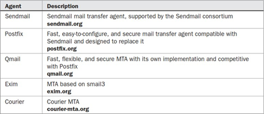

[Regresar](/Administracion-de-Sistemas-y-Servicios-en-Red/)


# Unidad 2: Internet y servicios en red

# 🎯 **Objetivo de Aprendizaje**

Al finalizar la clase el estudiante será capaz de:

- Experimentar la gestión de servicios en red incluyendo servicios de Internet más usados  para el análisis de utilización de recursos computacionales que cumplan con  requerimientos específicos.

# 2.1 Administración de Servicios en Red
- [Conceptos básicos](#conceptos)
- [Protocolo FTP](#ftp)
- [Protocolo DNS](#dns)
- [Protocolo SMTP - POP - IMAP](#correo)
- [Protocolo HTTP](#proxy)


<a name="conceptos"> </a>

## 💻 Conceptos básicos

- Un único sistema Linux puede proporcionar varios tipos diferentes de servicios, que van desde seguridad a la  administración e incluyen servicios de Internet como: sitios web y sitios FTP, correo electrónico e impresión,  herramientas de seguridad como SSH y kerberos, herramientas de red administrativas como DHCP y LDAP.

- La interfaz de conexión de red es en sí un servicio que se puede reiniciar a voluntad. Cada servicio opera como un  “daemon” continuamente en ejecución que busca peticiones para sus servicios particulares. En el caso de un  servicio web, las solicitudes provendrán de usuarios remotos. Puede activar o desactivar los servicios iniciando  o apagando sus demonios.

- El proceso de iniciar o cerrar un servicio es manejado por scripts de servicio.


<a name="ftp"> </a>

## 💻  Protocolo FTP

<p align="center">
  
</p>

El software del servidor File Transfer Protocol (FTP) consiste en un daemon FTP y archivos de configuración. El daemon es un programa que comprueba continuamente las solicitudes de FTP de usuarios remotos. Cuando se recibe una solicitud, gestiona un inicio de sesión, establece la conexión a la cuenta de usuario solicitada y ejecuta los comandos FTP enviados por el usuario remoto. Utiliza el protocolo TCP, y el puerto 20, 21.

Existen varios servidores FTP disponibles para su uso en sistemas  operativos Linux:


**Paso 1. Instalar el paquete vsftpd**

```
[root@localhost ~]# yum -y install vsftpd
Dependencias resueltas.
===========================================================================================
 Paquete           Arquitectura       Versión                   Repositorio           Tam.
===========================================================================================
Instalando:
 vsftpd            aarch64            3.0.5-5.el9               appstream            164 k

Resumen de la transacción
===========================================================================================
Instalar  1 Paquete

Tamaño total de la descarga: 164 k
Tamaño instalado: 371 k
Descargando paquetes:
vsftpd-3.0.5-5.el9.aarch64.rpm                             105 kB/s | 164 kB     00:01    
-------------------------------------------------------------------------------------------
Total                                                       67 kB/s | 164 kB     00:02     
Ejecutando verificación de operación
Verificación de operación exitosa.
Ejecutando prueba de operaciones
Prueba de operación exitosa.
Ejecutando operación
  Preparando          :                                                                1/1 
  Instalando          : vsftpd-3.0.5-5.el9.aarch64                                     1/1 
  Ejecutando scriptlet: vsftpd-3.0.5-5.el9.aarch64                                     1/1 
  Verificando         : vsftpd-3.0.5-5.el9.aarch64                                     1/1 
Productos instalados actualizados.

Instalado:
  vsftpd-3.0.5-5.el9.aarch64                                                               
¡Listo!
```

**Paso 2. Configurar el archivo /etc/vsftpd/vsftpd.conf**

```
[root@localhost ~]# vi /etc/vsftpd/vsftpd.conf
# Allow anonymous FTP? (Beware - allowed by default if you comment this out).  anonymous_enable=YES	#Cambiar por anonymous_enable=NO
#
# Uncomment this to allow local users to log in.
# When SELinux is enforcing check for SE bool ftp_home_dir
local_enable=YES  #
# Uncomment this to enable any form of FTP write command.  write_enable=YES
#
# You may specify an explicit list of local users to chroot() to their home  # directory. If chroot_local_user is YES, then this list becomes a list of  # users to NOT chroot().
# (Warning! chroot'ing can be very dangerous. If using chroot, make sure that  # the user does not have write access to the top level directory within the
# chroot)
# chroot_local_user=YES   #Descomentar está línea quitandole el símbolo numeral
```

**Paso 3. Reiniciar el servicio**

```
[root@srv1-linux adita]#service vsftpd restart
```


<a name="dns"> </a>

## 💻 Protocolo DNS

Domain Name Service (DNS )Convierte nombres de máquinas a direcciones IP, es decir, mapea de una  nombre a una dirección y viceversa. Hay varios servicios que puede  utilizar para resolver direcciones IP. El más utilizado es Berkeley Internet  Name Domain service (BIND). Al configurar la biblioteca de resolución  para utilizar el servicio de nombres DNS para las búsquedas de host,  también tiene que indicar qué servidores de nombres utilizar. Hay un  archivo separado para esto llamado /etc/resolv.conf. Utiliza el  protocolo TCP/UDP con el puerto 53.
La configuración DNS más importante son las zonas de dominios que se  encuentran en el archivo /etc/named.conf. Entre los registros de  configuración de zonas se encuentran:
A: Este registro asocia una dirección IP con un nombre de host.  MX: Un intercambiador de correo para un dominio.
CNAME: Este registro asocia un alias con el nombre de host canónico de  un host.
PTR: Este tipo de registro se utiliza para asociar nombres en el dominio  in-addr.arpa con nombres de host.

<p align="center">
  
</p>

- Paquete del servicio dns: bind, bind-chroot, bind-utils

- Archivo de configuración de zona de dominio 

```
vbrew: /etc/named.conf
zone "vbrew.com" {
type master;  allow-transfer { 10.10.0.5;
172.16.90.4;
1.2.3.4;
};
file "/etc/bind/db.vbrew.com";
};
zone "0.168.192.in-addr.arpa" {  type master;
file "/etc/bind/db.192.168.0";
```

<a name="correo"> </a>

## 💻  Protocolo SMTP - POP - IMAP

<p align="center">
  
</p>

**Correo:** El servidor de correo proporcionan a los usuarios servicios de correo electrónico. Ellos  tienen sus propios protocolos TCP/IP tales como el Simple Mail Transfer Protocol (SMTP),  Post Office Protocol (POP), Internet Mail Access Protocol (IMAP). Muchas distribuciones  de Linux instalarán y configurarán automáticamente sendmail o postfix. También puede  configurar su sistema Linux para ejecutar un servidor POP. Dichos servidores de correo  están asociados con diferentes hosts mediante registros de intercambio de correo,  conocidos como registros MX, en la configuración DNS de una red. Utiliza el protocolo  SMTP para el correo saliente con el puerto 25 y el protocolo POP para el correo  entrante con el puerto 110.

<p align="center">
  
</p>

**Por ejemplo:**
name  espol.edu.ec
class
MX
type
0	espol-edu-ec.mail.protection.outlook.com


<p align="center">
  
</p>

- Servicio de correo saliente: sendmail

- Servicio de correo entrante: dovecot

- Servicio de administración vía web para el cliente de correo: SquirrelMail  https://squirrelmail.org/

- Servicio de Anti-spam: SpamAssassin  http://spamassassin.apache.org/


<a name="proxy"> </a>

## 💻 Protocolo HTTP

Los protocolos soportados por squid son:

Los servidores proxy operan como un  intermediario entre una red local y los  servicios disponibles en uno más grande  como Internet. Los servidores proxy  mantienen copias actuales de las páginas  web de acceso común. Squid es un servidor  gratuito, de código abierto y de caché  proxy para clientes web, diseñado para  acelerar el acceso a Internet y proporcionar  controles de seguridad para servidores web.  Utiliza el protocolo TCP, y el puerto 3128.

Los protocolos soportados por squid son:


<p align="center">
  
</p>


<p align="center">
  
</p>

- Paquete: squid

- Paquete para generación de reporte del squid: SARG


<p align="center">
  
</p>