[Regresar](/Administracion-de-Sistemas-y-Servicios-en-Red/)


# Unidad 2: Internet y servicios en red

# 🎯 **Objetivo de Aprendizaje**

Al finalizar la clase el estudiante será capaz de:

- Experimentar la gestión de servicios en red incluyendo servicios de Internet más usados  para el análisis de utilización de recursos computacionales que cumplan con  requerimientos específicos.

# 2.2 Enrutamiento en Linux
- [Introducción](#introduccion)
- [Configuración de red](#configred)
- [Interfaces virtuales](#virtuales)
- [Linux como un router](#router)
- [Enrutamiento avanzado](avanzado)

<a name="introduccion"> </a>

## 💻 Introducción

- Linux soporta una implementación completa de los protocolos de red TCP/IP, lo cual ha resultado ser  hasta ahora el mejor mecanismo de comunicación entre ordenadores en todo el mundo.

- Implementar una pequeña red de área local de PCs con Linux es fácil. Sólo requiere una interfaz de  red en cada PC y los cables adecuados así como el dispositivo intermedio (enrutador, conmutador).

<p align="center">
  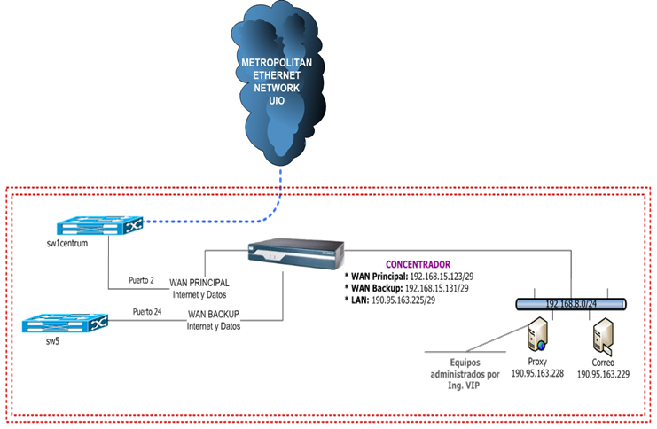
</p>


<a name="configred"> </a>

## 💻 Configuración de red

***Comando ifconfig:*** Configurar una interfaz de red.

```
[root@localhost ~]# ifconfig
ens160: flags=4163<UP,BROADCAST,RUNNING,MULTICAST>  mtu 1500
        inet 172.16.17.128  netmask 255.255.255.0  broadcast 172.16.17.255
        inet6 fe80::20c:29ff:fe8c:1508  prefixlen 64  scopeid 0x20<link>
        ether 00:0c:29:8c:15:08  txqueuelen 1000  (Ethernet)
        RX packets 229826  bytes 342319081 (326.4 MiB)
        RX errors 0  dropped 0  overruns 0  frame 0
        TX packets 85598  bytes 4703284 (4.4 MiB)
        TX errors 0  dropped 0 overruns 0  carrier 0  collisions 0
        device interrupt 50  memory 0x3fe00000-3fe20000  

lo: flags=73<UP,LOOPBACK,RUNNING>  mtu 65536
        inet 127.0.0.1  netmask 255.0.0.0
        inet6 ::1  prefixlen 128  scopeid 0x10<host>
        loop  txqueuelen 1000  (Local Loopback)
        RX packets 25  bytes 2581 (2.5 KiB)
        RX errors 0  dropped 0  overruns 0  frame 0
        TX packets 25  bytes 2581 (2.5 KiB)
        TX errors 0  dropped 0 overruns 0  carrier 0  collisions 0
```

Los archivos que arrancan la configuración de red TCP/IP se encuentran dentro del directorio /etc. Estos archivos  son leídos y puestos en marcha por el demónico llamado “network” al momento de booteo.


/etc/sysconfig/network-scripts/: Este directorio contiene los scripts “ifup” para activar una interfaz específica, “ifdown” para deshabilitar una  interfaz específica. Cada interfaz de red tiene un archivo que tiene el prefijo ifcfg-<iinterfaz>

<p align="center">
  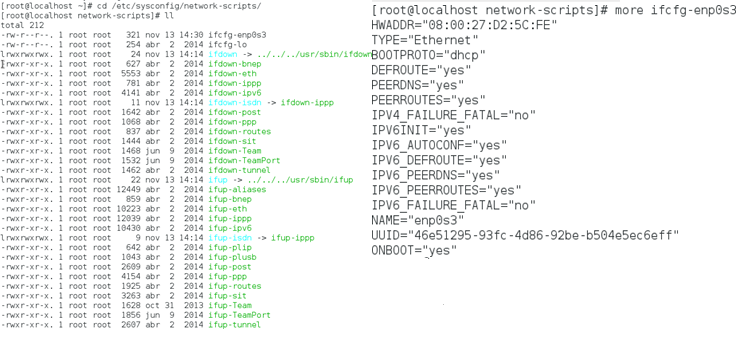
</p>


<p align="center">
  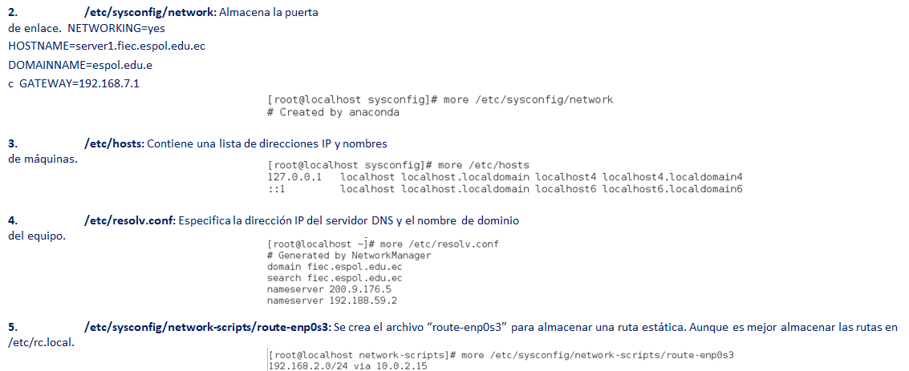
</p>


<a name="virtuales"> </a>

## 💻 Interfaces Virtuales

La configuración de múltiples direcciones IP en una misma interfaz de red física se denomina “IP  Aliasing”. Esto resulta útil cuando se requiere segmentar la red interna en varios prefijos de red sin  necesidad de una nueva interfaz de red.

La configuración de las interfaces virtuales se muestra a continuación:

1. Copie el archivo de configuración de la interfaz “ifcfg-enp0s3” con un nuevo nombre “ifcfg-enp0s3:1”.

```
[root@linux network-scripts]# cp ifcfg-enp0s3 ifcfg-enp0s3:1

```

2. Edite el nuevo archivo ifcfg-enp0s3:1 específicamente las variables:

```
[root@linux network-scripts]# more ifcfg-enp0s3:1  TYPE="Ethernet"
BOOTPROTO="static"
DEFROUTE="yes"  IPV4_FAILURE_FATAL="no"  IPV6INIT="yes"  IPV6_AUTOCONF="yes"  IPV6_DEFROUTE="yes"  IPV6_FAILURE_FATAL="no"  NAME="enp0s3:1"
UUID="46e51295-93fc-4d86-92be-b504e5ec6eff"  ONBOOT="yes"
HWADDR=08:00:27:D2:5C:FE
PEERDNS=yes  PEERROUTES=yes  IPV6_PEERDNS=yes  IPV6_PEERROUTES=yes  IPADDR=192.168.1.1  NETMASK=255.255.255.0  DEVICE="enp0s3:1”

```

Para que la configuración de las interfaces virtuales se almacene de manera permanente realice los siguientes pasos:

3. Reinicie el servicio de red.

```
[root@linux acollaguazo]# systemctl restart network

```

4. Muestre la información de las interfaces de red.

```
[root@linux network-scripts]# ifconfig
enp0s3: flags=4163<UP,BROADCAST,RUNNING,MULTICAST>
inet 10.0.2.15	netmask 255.255.255.0	broadcast 10.0.2.255  inet6 fe80::a00:27ff:fed2:5cfe	prefixlen 64	scopeid 0x20<link>  ether 08:00:27:d2:5c:fe	txqueuelen 1000	(Ethernet)

RX packets 6	bytes 550 (550.0 B)
RX errors 0	dropped 0	overruns 0	frame 0
TX packets 122	bytes 16741 (16.3 KiB) collisions 0
TX errors 0	dropped 0 overruns 0	
carrier 0

enp0s3:1: flags=4163<UP,BROADCAST,RUNNING,MULTICAST>	mtu 1500
inet 192.168.1.1	netmask 255.255.255.0	broadcast 192.168.1.255
ether 08:00:27:d2:5c:fe	txqueuelen 1000	(Ethernet)

```
Para visualizar el estado de las interfaces de red y la información de las direcciones IP y MAC.

```

[root@linux network-scripts]# ip address list
1: lo: <LOOPBACK,UP,LOWER_UP> mtu 65536 qdisc noqueue state UNKNOWN
link/loopback 00:00:00:00:00:00 brd 00:00:00:00:00:00  inet 127.0.0.1/8 scope host lo
valid_lft forever preferred_lft forever  inet6 ::1/128 scope host
valid_lft forever preferred_lft forever
2: enp0s3: <BROADCAST,MULTICAST,UP,LOWER_UP> mtu 1500 qdisc pfifo_fast state UP qlen 1000  link/ether 08:00:27:d2:5c:fe brd ff:ff:ff:ff:ff:ff
inet 10.0.2.15/24 brd 10.0.2.255 scope global enp0s3  valid_lft forever preferred_lft forever
inet 192.168.1.1/24 brd 192.168.1.255 scope global enp0s3:1
valid_lft forever preferred_lft forever  inet6 fe80::a00:27ff:fed2:5cfe/64 scope link
valid_lft forever preferred_lft forever
```


<a name="router"> </a>

## 💻 Linux como un enrutador

Normalmente, un sistema Linux no envía los paquetes que recibe de un sistema que son da otro sistema. Si Linux  actuará como un router, debe aceptar estos paquetes y enviarlos a la red de destino. Para activar esta función,  debe modificar un archivo en el directorio /proc:

```
[root@linux network-scripts]# echo “1” > /proc/sys/net/ipv4/ip_forward
```

Este comando habilita el IP forwarding. La configuración permanente de esta opción requiere la modificación  del archivo /etc/sysctl.conf.

```
net.ipv4.ip_forward = 1
```


<a name="avanzado"> </a>

## 💻 Enrutamiento avanzado
Introducción a IPROUTE2
+ Este paquete es llamado “iproute” es un conjunto de herramientas para administrar interfaces de red y conexiones en sistemas  Linux.
+ Extiende las características similares a las provistas por dispositivos exclusivamente dedicados al ruteo y control de tráfico.
+ Este paquete reemplaza completamente las funcionalidades presentes en ifconfig, route, y ARP.
+ Los túneles son una parte integral de un conjunto de herramientas.

Algunas de las funcionalidades principales que provee iproute2 son:
1. QoS
2. Mantener múltiples tablas de ruteo
3. Balanceo de carga
4. Definición de túneles.

- La herramienta IP es el punto central

<p align="center">
  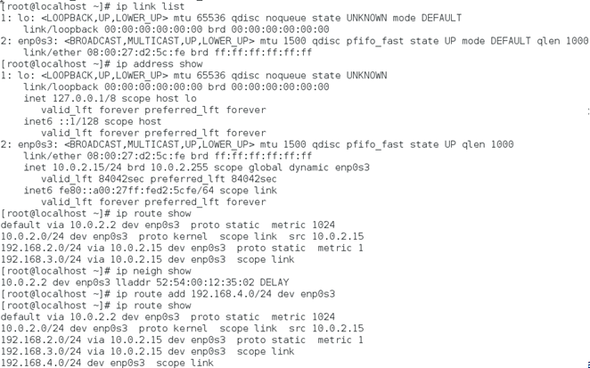
</p>


## 💻 **Comandos Ping y Traceroute**


**Ping:** Envía un datagrama ICMP ECHO_REQUEST al  destino, esperando un ECHO_RESPONSE de ICMP. Ping  se utiliza con frecuencia para comprobar la  conectividad de red básica.

**Traceroute:** Muestra la ruta que toman los paquetes  para llegar al destino, mostrando los enrutadores  intermedios.

<p align="center">
  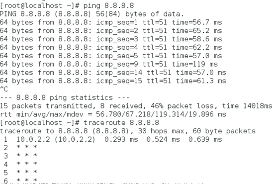
</p>

## 💻 **Comando Ping**

+ El comando ping se puede usar para determinar si otra máquina es "accesible".

+ Por defecto, el comando ping continuará enviando paquetes sin fin.

+ Use la opción -c seguido de un número para limitar cuántos pings enviar.
+ Un ping exitoso se ve así:

<p align="center">
  
</p>

Si el comando ping falla, aparecerá un mensaje que indica “Host de destino inalcanzable”:

<p align="center">
  
</p>

## COMANDOS ETHTOOL O MII-TOOL

El comando “ethtool” permite verificar el estado de conexión de las interfaz.


```

[root@linux network-scripts]# ethtool enp0s3  
Settings for enp0s3:  10baseT/Half 10baseT/Full  
Supported ports: [ TP ] 100baseT/Half 100baseT/Full
                        1000baseT/Full
Supported pause frame use: No  Supports auto-negotiation: Yes
Advertised link modes: 10baseT/Half 10baseT/Full  
                       100baseT/Half 100baseT/Full  
                       1000baseT/Full
Advertised pause frame use: No  Advertised auto-negotiation: Yes  Speed: 1000Mb/s
Duplex: Full
Port: Twisted Pair  PHYAD: 0
Transceiver: internal
Auto-negotiation: on  MDI-X: off (auto)  Supports Wake-on: umbg  Wake-on: d
Current message level: 0x00000007 (7)
drv probe link  Link detected: yes
```

## 💻 **Comando Ifconfig**

+ El comando ifconfig significa ”configuración de interfaz".
+ Se usa para mostrar información de configuración de red:

<p align="center">
  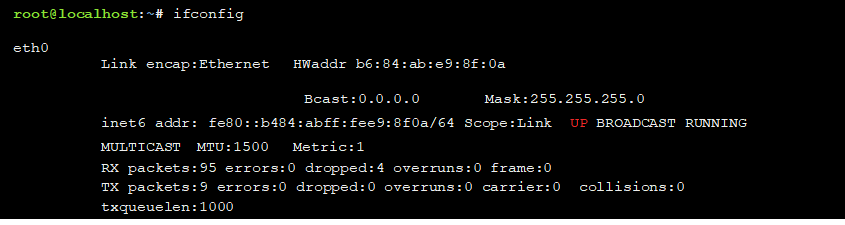
</p>


+ En la salida anterior, la dirección IP del dispositivo de red primario (eth0) es 192.168.1.2 y el dispositivo está  actualmente activo (UP).

## 💻 **Comando IP**

+ El comando ip está reemplazando el comando ifconfig.

+ El comando ip ha aumentado la funcionalidad y el conjunto de opciones.

+ El formato para el comando ip es el siguiente:

```
ip [options] Object Command
```

+ Ambos (ip e ifconfig) muestran el tipo de interfaz, protocolos, hardware y  direcciones IP, máscaras de red y otra información variada sobre cada una de las  interfaces activas en el sistema.

## 💻 **Comandos Ifconfig vs. IP**

<p align="center">
  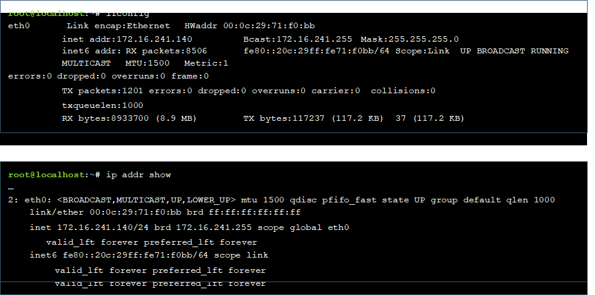
</p>

## 💻 **Comando Route**

El comando de ruta se puede usar para ver una tabla que describe dónde se envían los paquetes 

<p align="center">
  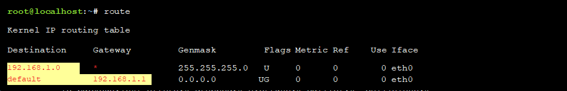
</p>

+ Cualquier paquete de red enviado a una máquina en la red 192.168.1 no se envía a la puerta de enlace (*  indica "sin puerta de enlace").
+ Todos los demás paquetes de red se envían al host con la dirección IP 192.168.1.1 (el enrutador).

<p align="center">
  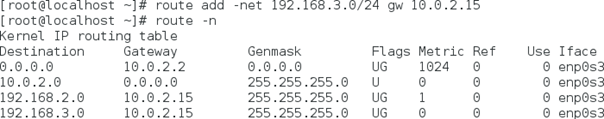
</p>

**Recordatorio: Un enrutador o puerta de enlace es una máquina que permitirá que los hosts de una red se comuniquen con otra red.**

## **Comando Netstat**

+ El comando netstat se usa para mostrar información sobre las conexiones de red, así como para mostrar la  tabla de enrutamiento similar al comando route:

<p align="center">
  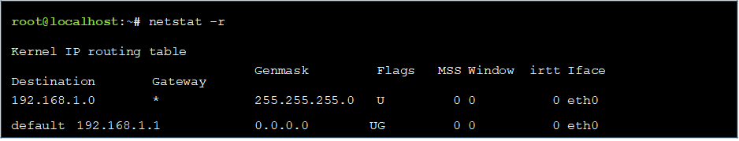
</p>

+ El comando netstat también se usa comúnmente para mostrar puertos abiertos:

<p align="center">
  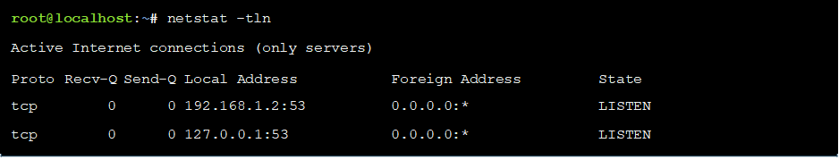
</p>

## 💻 **Comando SS**

+ El comando ss está diseñado para mostrar estadísticas de socket y admite todos los tipos principales de paquetes y socket.

+ Se usa para ver las conexiones establecidas actualmente entre su máquina local y las máquinas remotas, así como las estadísticas sobre esas  conexiones.

+ Esta salida es muy similar a la salida del comando **netstat** sin opciones.

## 💻 **Comando Dig**

El comando dig realizará consultas en el servidor DNS para determinar si la información necesaria está  disponible en el servidor.

Por ejemplo, el comando dig se usa para determinar la dirección IP del host example.com:

<p align="center">
  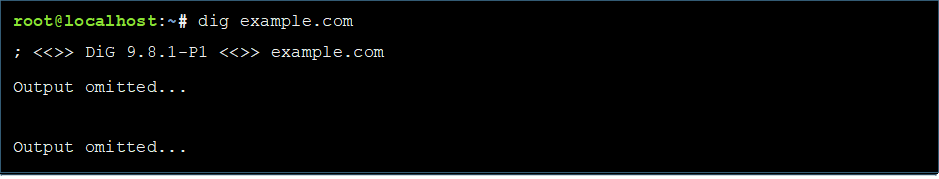
</p>

El servidor DNS tiene la dirección de IP (192.168.1.2) a la información de traducción de nombre de host  (example.com) en su base de datos.

## 💻 Comandos DIG y NSLOOKUP

<p align="center">
  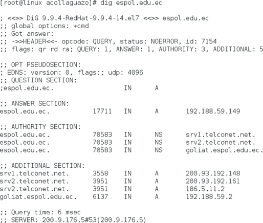
</p>

```
[root@ workstation acollaguazo]# nslookup
set type=MX
unc.edu
Server:	tao.linux.org.au  Address:		203.41.101.121
unc.edu preference = 0, mail exchanger = conga.oit.unc.edu  unc.edu preference = 10, mail exchanger = imsety.oit.unc.edu 
conga.oit.unc.edu  imsety.oit.unc.edu
internet address = 152.2.22.21  internet address = 152.2.21.99
ns.unc.edu	internet address = 152.2.21.1  ns2.unc.edu	internet address = 152.2.253.100  ncnoc.ncren.net internet address = 192.101.21.1  ncnoc.ncren.net internet address = 128.109.193.1
```
##  💻**Comando Host**

+ El comando host funciona con DNS para asociar un nombre de host con una dirección IP:
<p align="center">
  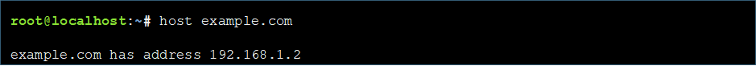
</p>

+ El comando host también se puede usar en reversa si se conoce una dirección IP, pero no el nombre de  dominio:

<p align="center">
  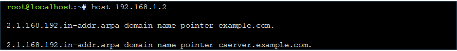
</p>

+ Existen otras opciones para consultar los diversos aspectos de un DNS como CNAME (nombre canónico) y  SOA (inicio de autoridad).

## 💻**Comando TELNET**

El comando “telnet” establece una conexión a un host (ya sea un nombre de sistema o una  dirección IP) mediante puerto. Si un puerto se omite, el puerto predeterminado de 23 se  asume. Si se omite el host, telnet entra en un modo similar al FTP.
<p align="center">
  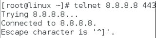
</p>
## 💻 **Comando SSH**

El comando ssh le permitirá conectarse a otra máquina a través de la red, iniciar sesión y luego realizar  tareas en la máquina remota:

<p align="center">
  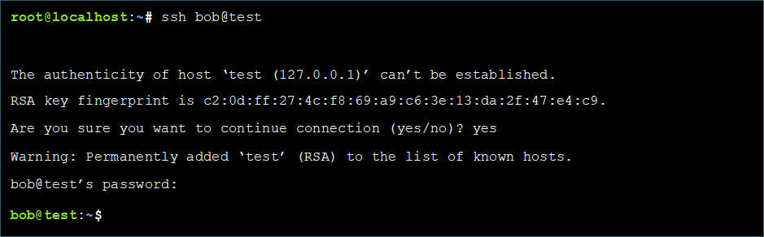
</p>

To return back to the local machine, use the **exit** command.


**RSA key fingerprint (huella digital de la clave RSA)**

+ Si responde yes en el mensaje (solicitando verificar la identidad de la máquina), la huella digital de la clave RSA  de la máquina remota se almacenará en su sistema local:

+ Cuando intente ssh en la misma máquina en el futuro, la huella digital de la clave RSA proporcionada por la máquina remota se  compara con la copia almacenada en la máquina local.

+ Si no coinciden, verá un mensaje de error.

+ nombre de archivo chmod 700

## 💻 **Comandos LYNX Y CURL**

El comando “lynx” o “curl” permite navegar desde la línea de comandos, para verificar la resolución DNS.

<p align="center">
  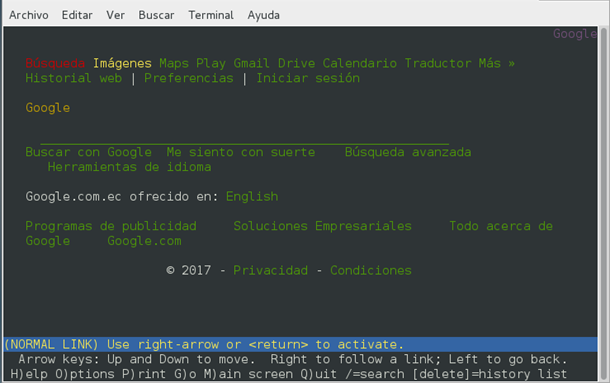
</p>

## 💻 **Configuración de Interfaz de Red en DEBIAN/UBUNTU**

### **vi /etc/network/interfaces**
allow-hotplug eth0  
iface eth0
inet static address 192.168.11.100  netmask 255.255.255.0
gateway 192.168.11.1  
dns-domain example.com 
dns-nameservers 192.168.11.1

