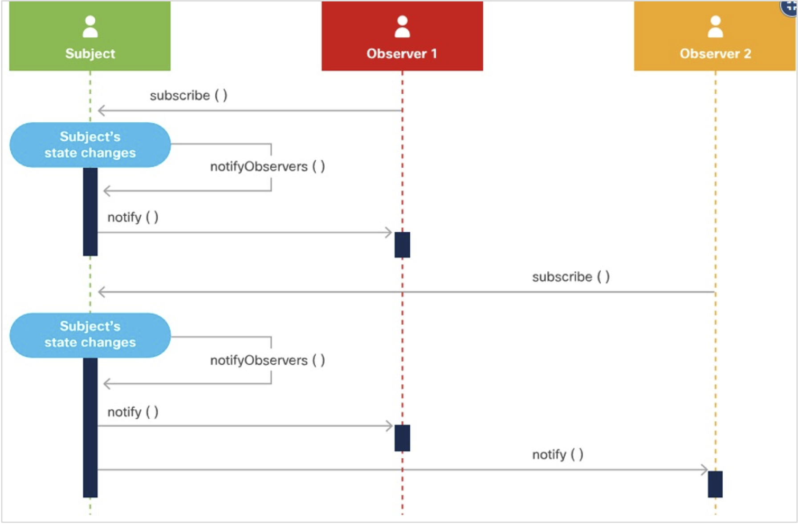
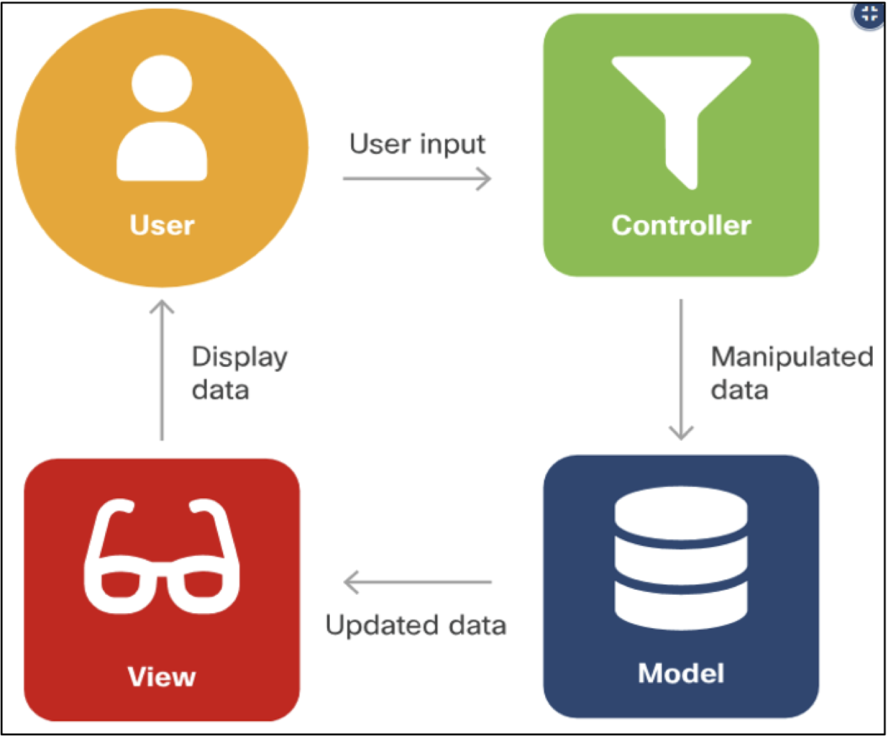

[Regresar](/Administracion-de-Sistemas-y-Servicios-en-Red/)

# Unidad 3: Tecnologías Web

# 🎯 **Objetivo de Aprendizaje**
Al finalizar la clase el estudiante será capaz de:
- Diseñar sitios web dinámicos y sus funciones para la administración de la información usando gestores de base de datos.

# 3.1 Internet y servicios web
- [Patrones de diseño de software](#patrones)
    - [Diseño de Observador](#observador)
    - [Modelo Vista Controlador (MVC)](#mvc)

## 💻 Patrones de diseño de software

### 🕸️ Diseño de Observador

- El patrón de diseño de observador es un diseño de notificación de suscripción que permite a los objetos recibir eventos cuando hay cambios en un objeto que están observando.
- Para implementar este mecanismo de suscripción:
    - El sujeto debe tener la capacidad de almacenar una lista de todos sus observadores.
    - El sujeto debe tener métodos para agregar y eliminar observadores.
- El beneficio del patrón de diseño del observador es que los observadores pueden obtener datos en tiempo real del sujeto cuando se produce un cambio.
- Los mecanismos de suscripción siempre proporcionan un mejor rendimiento que otras opciones, como el sondeo.

  

### 🕸️ Modelo Vista Controlador (MVC)
- El patrón de diseño Model View Controller (MVC) tiene como objetivo simplificar el desarrollo de aplicaciones que dependen de interfaces gráficas de usuario.
- MVC abstrae el código y la responsabilidad en tres componentes diferentes:
    - Modelo: El modelo es la estructura de datos de la aplicación y es responsable de gestionar los datos, la lógica y las reglas de la aplicación. Obtiene la entrada del controlador.
    - Vista: La vista es la representación visual de los datos. 
    - Controlador: El controlador es el intermediario entre el modelo y la vista. Toma la entrada del usuario y la manipula para ajustarse al formato del modelo o vista.

- La ventaja de MVC es que cada componente se puede construir en paralelo.

  

