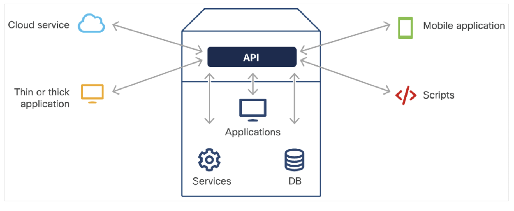
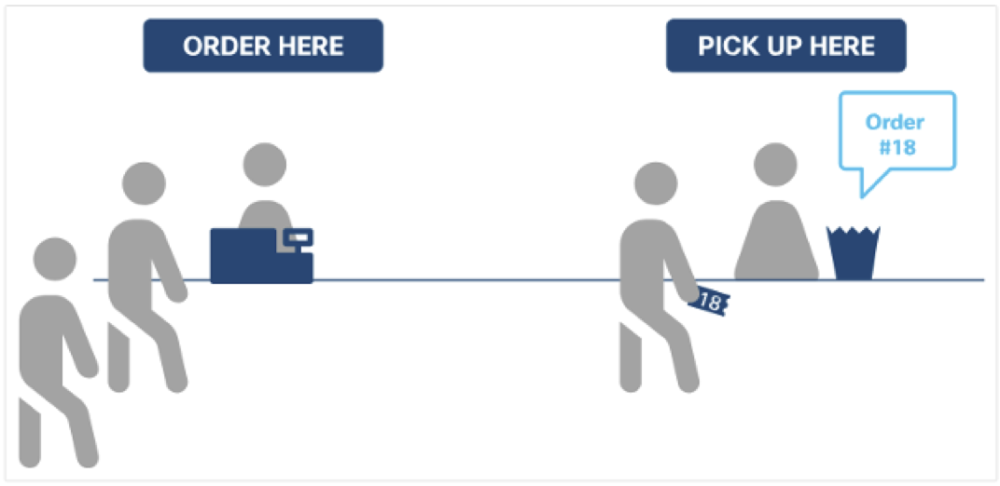
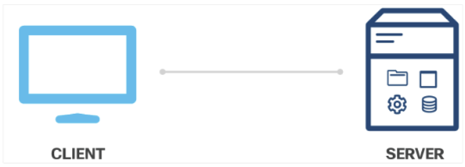
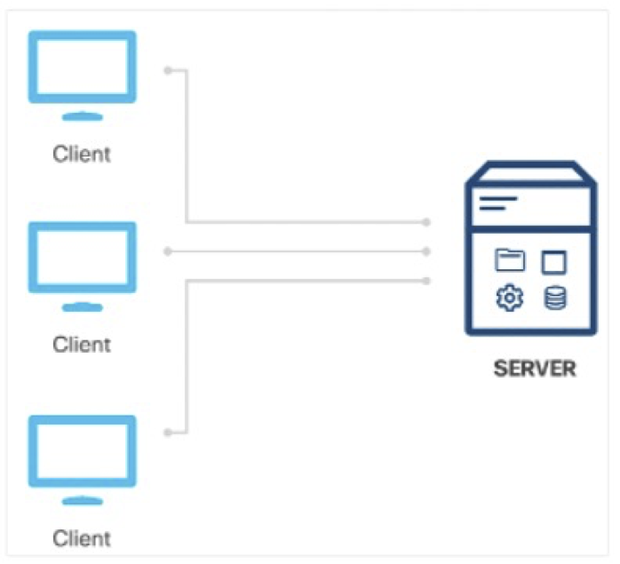
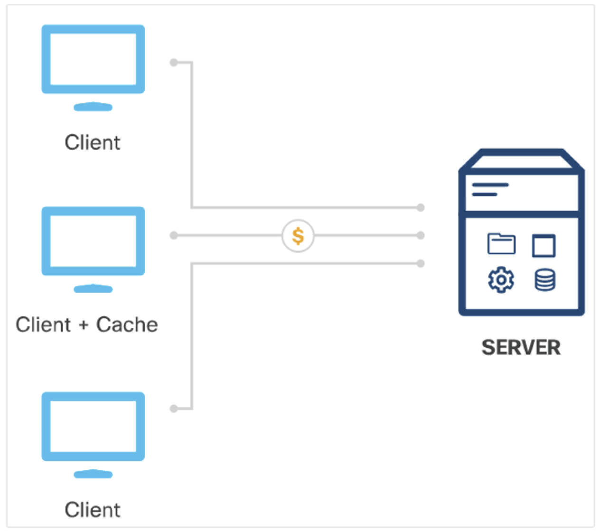
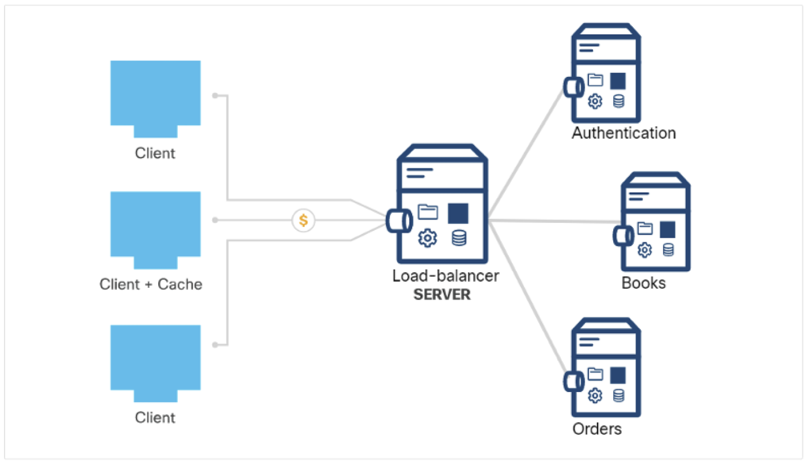

[Regresar](/Administracion-de-Sistemas-y-Servicios-en-Red/)

# Unidad 3: 

# 🎯 **Objetivo de Aprendizaje**
Al finalizar la clase el estudiante será capaz de:
- Diseñar sitios web dinámicos y sus funciones para la administración de la información usando gestores de base de datos.

# 3.1 Internet y servicios web
- [Patrones de diseño de software](#patrones)
    - [Diseño de Observador](#observador)
    - [Modelo Vista Controlador (MVC)](#mvc)
- [API](#api)
    - [¿Por qué se usan las APIs?](#uso_api)
    - [APIs sincrónicas](#sincronicas)
    - [APIs asincrónica](#asincronicas)
    - [Estilos de Arquitectura de la API](#estilos)
- [REST API](#rest)
    - [Solicitudes de API REST](#solicitudes)
    - [Respuestas API REST](#respuestas)
    - [Diagramas de secuencia con API REST](#diagramas)
    - [Mecanismos de autenticación](#autenticacion)
- [Webhoook](#webhook)
- [Formato de datos](#formato)
    - [XML](#xml)
    - [JSON](#json)
    - [YAML](#yaml)

## 💻 Patrones de diseño de software

### 🕸️ Diseño de Observador

- El patrón de diseño de observador es un diseño de notificación de suscripción que permite a los objetos recibir eventos cuando hay cambios en un objeto que están observando.
- Para implementar este mecanismo de suscripción:
    - El sujeto debe tener la capacidad de almacenar una lista de todos sus observadores.
    - El sujeto debe tener métodos para agregar y eliminar observadores.
- El beneficio del patrón de diseño del observador es que los observadores pueden obtener datos en tiempo real del sujeto cuando se produce un cambio.
- Los mecanismos de suscripción siempre proporcionan un mejor rendimiento que otras opciones, como el sondeo.

  

### 🕸️ Modelo Vista Controlador (MVC)
- El patrón de diseño Model View Controller (MVC) tiene como objetivo simplificar el desarrollo de aplicaciones que dependen de interfaces gráficas de usuario.
- MVC abstrae el código y la responsabilidad en tres componentes diferentes:
    - Modelo: El modelo es la estructura de datos de la aplicación y es responsable de gestionar los datos, la lógica y las reglas de la aplicación. Obtiene la entrada del controlador.
    - Vista: La vista es la representación visual de los datos. 
    - Controlador: El controlador es el intermediario entre el modelo y la vista. Toma la entrada del usuario y la manipula para ajustarse al formato del modelo o vista.

- La ventaja de MVC es que cada componente se puede construir en paralelo.

  

## 💻 API

- Una interfaz de programación de aplicaciones (API) permite una conversación de software con otra.
- Utiliza interacciones basadas en la web o protocolos de comunicación comunes y sus propios estándares patentados.
- Una API determina qué tipo de datos, servicios y funcionalidad expone la aplicación a terceros.
- Al proporcionar API, las aplicaciones pueden controlar lo que exponen de forma segura.

  

### 🕸️ ¿Por qué se usan las APIs?

Las API están diseñadas para ser consumidas mediante programación por otras aplicaciones y también pueden ser usadas por humanos que desean interactuar con la aplicación manualmente.
Los casos de uso de las API son los siguientes:

- **Tareas de automatización:** cree un script que realice tareas manuales de forma automática y programática.
- **Integración de datos:** una aplicación puede consumir o reaccionar a los datos proporcionados por otra aplicación.
- **Funcionalidad:** una aplicación puede integrar la funcionalidad de otra aplicación en su producto.

### 🕸️ APIs sincrónicas

- Las API sincrónicas responden directamente a una solicitud proporcionando datos inmediatamente.

**¿Cuándo las API son sincrónicas?**
- Las API son sincrónicas cuando los datos de la solicitud están disponibles fácilmente.

**Ventajas de un diseño de API sincrónico**
- Las API sincrónicas permiten que la aplicación reciba datos inmediatamente. Si la API está diseñada correctamente, el rendimiento de la aplicación será mejor.

**Procesamiento del lado del cliente**
- La aplicación que realiza la solicitud de API debe esperar la respuesta antes de realizar tareas adicionales de ejecución de código.

  

***Las entradas se venden en orden por orden de llegada. Este es un proceso sincrónico.***

### 🕸️ APIs asincrónica
- Las API asincrónicas proporcionan una respuesta (sin datos) para indicar que se ha recibido la solicitud.

**¿Cuándo son asincrónicas las API?**
- Las API son asincrónicas cuando la solicitud tarda algún tiempo en procesarse el servidor o si los datos no están disponibles fácilmente.

**Beneficio del diseño de API asincrónico**
- Las API asincrónicas permiten que la aplicación continúe su ejecución sin ser bloqueada hasta que el servidor procese la solicitud, lo que resulta en un mejor rendimiento.

**Procesamiento del lado del cliente**
- Con el procesamiento asincrónico, el diseño de la API en el lado del servidor define el requisito en el lado del cliente.

  

### 🕸️ Estilos de Arquitectura de la API

**Cliente-Servidor**
- El cliente y el servidor deben ser independientes entre sí.
- Esto permitirá que el cliente se construya para múltiples plataformas, lo que simplificará los componentes del lado del servidor.

  

**Sin estado**
- Las solicitudes del cliente al servidor deben contener el modelo cliente-servidor REST y toda la información que el servidor necesita para realizar la solicitud.
- El servidor no puede contener estados de sesión.

  

**Modelo de caché**
• Las respuestas del servidor deben indicar si la respuesta se puede almacenar en caché o no en caché.
• Si se puede almacenar en caché, el cliente puede utilizar los datos de la respuesta para solicitudes posteriores.

  

**Interfaz uniforme**
La interfaz entre el cliente y el servidor se adhiere a los cuatro principios:
- Identificación de recursos
- Manipulación de recursos a través de representaciones • Mensajes autodescriptivos
- Hypermedia como motor del estado de la aplicación.

**Sistema de capas**
El sistema en capas consta de diferentes capas jerárquicas en las que cada capa proporciona servicios sólo a la capa que está encima.
Como resultado, consume servicios de la capa siguiente.

  

**Código bajo demanda**
Modelo de sistema en capas REST
- La información devuelta por un servicio REST puede incluir código ejecutable (por ejemplo, javascript) o enlaces destinados a extender de manera útil la funcionalidad del cliente.
- La restricción es opcional porque la ejecución de códigos de terceros introduce posibles riesgos de seguridad.

- [REST API](#rest)
    - [Solicitudes de API REST](#solicitudes)
    - [Respuestas API REST](#respuestas)
    - [Diagramas de secuencia con API REST](#diagramas)
    - [Mecanismos de autenticación](#autenticacion)
- [Webhoook](#webhook)
- [Formato de datos](#formato)
    - [XML](#xml)
    - [JSON](#json)
    - [YAML](#yaml)
  Introducción a las API de REST
REST Web Service API REST

- Transferencia de Estado Representacional (REST) es un estilo arquitectónico escrito por Roy Thomas Fielding.
- Roy ha establecido seis restricciones que se pueden aplicar a cualquier protocolo en REST.
- Una API de servicio web REST (API REST) es una interfaz de programación que se comunica a través de HTTP.
- Las API REST utilizan los mismos conceptos que el protocolo HTTP que son los siguientes:
• Solicitudes/respuestas HTTP
• Verbos HTTP
• Código de estado HTTP
• Encabezados/cuerpo HTTP
Modelo de solicitud/respuesta de API REST
 DOCENTE: MSIG. ADRIANA COLLAGUAZO JARAMILLO 14

  Introducción a las API de REST Solicitudes de API REST
• Las solicitudes de API REST son solicitudes HTTP que son una forma de que una aplicación (cliente) pida al servidor que realice una función.
• Las solicitudes de API REST se componen de cuatro componentes principales:
• Identificador uniforme de recursos (URI)
• Método HTTP: • Encabezado
• Cuerpo
DOCENTE: MSIG. ADRIANA COLLAGUAZO JARAMILLO 15

  Introducción a las API de REST Solicitudes de API REST (Cont.)
El identificador uniforme de recursos (URI), también conocido como localizador uniforme de recursos (URL), identifica qué recurso desea manipular el cliente. Los componentes de un URI son:
• Esquema: especifica qué protocolo HTTP se debe usar, http o https.
• Autoridad: consta de dos partes, a saber, host y puerto.
• Ruta de acceso: representa la ubicación del recurso, los datos u objeto, que se va a manipular en el servidor.
• Consulta: proporciona detalles adicionales sobre el ámbito, el filtrado o para aclarar una solicitud.
Diferentes componentes de un URI
 DOCENTE: MSIG. ADRIANA COLLAGUAZO JARAMILLO 16

  Introducción a las API de REST Solicitudes de API REST (Cont.)
Método HTTP:
• Las API REST utilizan los métodos HTTP estándar para comunicarse con los servicios web para los que se solicita la acción para el recurso dado.
• La asignación sugerida del método HTTP a la acción es la siguiente:
     Método HTTP:
Acción
Descripción
POST
Crear (Create)
Crear un nuevo objeto o recurso.
GET
lectura (Read)
Recuperar detalles de recursos del sistema.
PUT
Actualizar
Reemplace o actualice un recurso existente.
PARCHE
Actualización parcial
Actualice algunos detalles de un recurso existente.
DELETE
Eliminar (Delete)
Remover un recurso del sistema.
            DOCENTE: MSIG. ADRIANA COLLAGUAZO JARAMILLO 17

  Introducción a las API de REST
Solicitudes de API REST (Cont.)
Encabezado:
• Los encabezados HTTP tienen el formato de pares nombre-valor separados por dos puntos (:), [nombre]: [valor]. Dos tipos de encabezados:
• Encabezados de solicitud : incluye información adicional que no esté relacionada con el contenido del mensaje.
     Clave
Valor de ejemplo
Descripción
Autorización
DMFNCMFUDDP2YWDYYW básico
Proporciona credenciales para autorizar la solicitud
    •
Encabezados de entidad: información adicional que describe el contenido del cuerpo del mensaje.
      Clave
Valor de ejemplo
Descripción
 Tipo de contenido
aplicación/ JSON
Especificar el formato de los datos en el cuerpo
    DOCENTE: MSIG. ADRIANA COLLAGUAZO JARAMILLO 18

  Introducción a las API de REST
Solicitudes de API REST
Cuerpo:
• El cuerpo de la solicitud de API REST contiene los datos correspondientes al recurso que el cliente desee manipular.
• Las solicitudes de API REST que utilizan el método HTTP POST, PUT y PATCH suelen incluir un cuerpo.
• El cuerpo es opcional dependiendo del método HTTP.
• Si los datos se proporcionan en el cuerpo, entonces el tipo de datos debe especificarse en el encabezado mediante la clave de Content-Type.
DOCENTE: MSIG. ADRIANA COLLAGUAZO JARAMILLO 19

  Introducción a las API de REST Respuestas API REST
• Las respuestas de la API REST son respuestas HTTP que comunica los resultados de la solicitud HTTP de un cliente.
• Respuesta REST API se componen de tres componentes principales: • Estado HTTP
• Encabezado
• Cuerpo
DOCENTE: MSIG. ADRIANA COLLAGUAZO JARAMILLO 20

 Introducción a las API de REST Respuestas API REST
Estado HTTP
 • • •
• • • •
•
El código de estado HTTP ayuda al cliente a determinar el motivo del error y a veces puede proporcionar sugerencias para solucionar el problema.
Los códigos de estado HTTP constan de tres dígitos, donde el primer dígito es la categoría de respuesta y los otros dos dígitos son asignados en orden numérico.
Hay cinco categorías diferentes de códigos de estado HTTP:
1xx — Informativo — con fines informativos, las respuestas no contienen un cuerpo
2xx — Éxito: el servidor recibió y ha aceptado la solicitud
3xx — Redirección : el cliente tiene que tomar una acción adicional para completar la solicitud
4xx — Error de cliente — la solicitud contiene un error como sintáxis incorrecta o entrada no
válida
5xx — Error del servidor — no se pueden cumplir las solicitudes válidas.
DOCENTE: MSIG. ADRIANA COLLAGUAZO JARAMILLO 21

 Introducción a las API de REST Respuestas API REST
Los códigos de estado HTTP comunes son los siguientes:
      Código de Estado HTTP
Mensaje de estado
Descripción
200
Aceptar
La solicitud se realizó correctamente y normalmente contiene una carga útil (cuerpo)
201
Creada
Se cumplió la solicitud y se creó el recurso que fue solicitado
202
Aceptada
La solicitud ha sido aceptada para su procesamiento y está en proceso
400
Solicitud no válida
La solicitud no se procesará debido a un error con la solicitud
401
No autorizado
La solicitud no tiene credenciales de autenticación válidas para realizar la solicitud
403
Prohibida
La solicitud ha sido entendida pero ha sido rechazada por el servidor
404
No se encontró
No se puede cumplir la solicitud porque la ruta de acceso del recurso de la solicitud no se encontró en el servidor
500
Error del servidor interno
No se puede cumplir la solicitud debido a un error del servidor
503
El servicio no está disponible
No se puede cumplir la solicitud porque actualmente el servidor no puede manejar la solicitud
                    DOCENTE: MSIG. ADRIANA COLLAGUAZO JARAMILLO 22

 Introducción a las API de REST Respuestas API REST
• Encabezado - El encabezado de la respuesta es proporcionar información adicional entre el servidor y el cliente en el formato de par nombre-valor que está separado por dos puntos ( : ), [nombre]: [valor] .Hay dos tipos de encabezados: encabezados de respuesta y encabezados de entidad.
• Encabezados de respuesta: contiene información adicional que no está relacionada con el contenido del mensaje. Los encabezados de respuesta típicos para una solicitud de API REST incluyen:
      Clave
Valor de ejemplo
Descripción
Set-Cookie
JSESSIONID=30A9DN810FQ428P; Ruta=/
Se utiliza para enviar Cookies desde el servidor
Control de caché
Control de caché: max-edad=3600, público
Especificar directivas que DEBEN ser obedecidas por todos los mecanismos de almacenamiento en el caché
      • Encabezados de entidad: Son información adicional que describe el contenido del cuerpo del mensaje. Un encabezado de entidad común especifica el tipo de datos que son devueltos:
     Clave
Valor de ejemplo
 Descripción
Tipo de contenido
Aplicación/JSON
 Especificar el formato de los datos en el cuerpo
    DOCENTE: MSIG. ADRIANA COLLAGUAZO JARAMILLO 23

  Introducción a REST API Respuestas API REST
Paginación de respuestas
• Lapaginaciónderespuestaspermitedividirlosdatosenfragmentos.
• La mayoría de las API que implementan la paginación utilizan el parámetro de consulta para especificar qué
página devolver en la respuesta.
Datos de respuesta comprimidos
• Losdatoscomprimidosreducenlagrancantidaddedatosquenosepuedenpaginar.
• Para solicitar una compresión de datos, la solicitud debe agregar el campo Accept-Encoding al encabezado de
solicitud. Los valores aceptados son:
• gzip
• Comprimir • desinflar
• br
• identidad •*
DOCENTE: MSIG. ADRIANA COLLAGUAZO JARAMILLO 24

 Introducción a las API REST
Utilizando diagramas de secuencia con API REST
 • Los diagramas de secuencia se utilizan para explicar una secuencia de intercambios o eventos.
• El diagrama de secuencia de solicitud de API tiene tres secuencias separadas:
• Crear sesión: la solicitud de inicio se etiqueta como HTTPS: Crear sesión con credenciales.
• Obtener dispositivos : solicite una lista de dispositivos de la plataforma.
• Crear dispositivo : empieza con una solicitud POST para crear un dispositivo.
Diagrama de secuencia de petición/respuesta de API
 DOCENTE: MSIG. ADRIANA COLLAGUAZO JARAMILLO 25

  Autenticación a una API REST Mecanismos de autenticación
Los tipos comunes de mecanismos de autenticación incluyen:
• Autenticación básica: transmite credenciales como pares de nombre de usuario/contraseña
separados con dos puntos (:) y codificados usando Base64.
• Autenticación al portador: Utiliza un token al portador, que es una cadena generada por un
servidor de autenticación como un servicio de identidad (ID).
• Clave API: Es una cadena alfanumérica única generada por el servidor y asignada a un usuario. Los dos tipos de claves API son públicas y privadas.
DOCENTE: MSIG. ADRIANA COLLAGUAZO JARAMILLO 26

 Trabajar con Webhooks
¿Qué es un Webhook?
• Un Webhook es una devolución de llamada HTTP, o un HTTP POST, a una URL especificada que notifica a la aplicación cuando se produce una actividad o evento en particular en los recursos.
• Con webhooks, las aplicaciones son más eficientes ya que no se requieren mecanismos de sondeo.
• Los webhooks también se conocen como API inversas, porque las aplicaciones se suscriben a un servidor webhook registrándose con el proveedor webhook.
• Varias aplicaciones pueden suscribirse a un único servidor webhook. Ejemplos:
• La plataforma Cisco DNA Center proporciona webhooks que permiten a las aplicaciones de terceros recibir datos de red cuando se producen eventos especificados.
• Puede crear un webhook para que Cisco Webex Teams le notifique de nuevos mensajes publicados en una sala en particular.
 DOCENTE: MSIG. ADRIANA COLLAGUAZO JARAMILLO 27

 Trabajar con Webhooks
¿Qué es un Webhook?
Los usos prácticos de los webhooks pueden incluir:
• Recordatorios automáticos diarios por correo electrónico para reuniones • Confirmaciones de pagos procesados y completados
• Sincronización de cambios en los datos de clientes entre aplicaciones.
  DOCENTE: MSIG. ADRIANA COLLAGUAZO JARAMILLO 28

  Comprendiendo Formatos de datos
FORMATOS DE DATOS
• Las API Rest le permiten intercambiar información con servicios remotos y equipamiento.
• Los tres formatos estándar más populares para intercambiar información con API remotas son XML, JSON y
YAML.
• El análisis de XML, JSON o YAML es un requisito frecuente para interactuar con las API. Un patrón frecuente en las implementaciones de API REST es el siguiente:
• Autenticar, normalmente mediante la publicación de una combinación de usuario/contraseña y la recuperación de un token que caduca para su uso en la autenticación de solicitudes posteriores.
• Ejecutar una solicitud GET a un extremo determinado (autenticando según sea necesario) para recuperar el estado de un recurso, solicitando XML, JSON o YAML como formato de salida.
• ModificarelXML,JSONoYAMLdevuelto.
• Ejecute un POST (o PUT) en el mismo punto final (de nuevo, autenticando según sea necesario) para cambiar el estado del recurso, solicitando nuevamente XML, JSON o YAML como formato de salida e interpretándolo según sea necesario para determinar si la operación se realizó correctamente.
DOCENTE: MSIG. ADRIANA COLLAGUAZO JARAMILLO 29

  Entendiendo Formatos de Datos XML
• Extensible Markup Language (XML) es una metodología genérica para envolver datos textuales en etiquetas simétricas para indicar semántica.
• Es un derivado de Structured Generalized Markup Language (SGML), y también el padre de HyperText Markup Language (HTML).Los nombres de archivo XML suelen terminar en ".xml"
Un ejemplo de documento XML
 DOCENTE: MSIG. ADRIANA COLLAGUAZO JARAMILLO 30

 Descripción de los formatos de datos XML
• Cuerpo del documento XML: Excepto las dos primeras líneas de un documento XML, el resto del documento se considera como el cuerpo.
• Nombres de etiquetas definidos por el usuario: Los nombres de etiquetas XML son definidos por el usuario. Si está redactando XML para su propia aplicación, elija nombres de etiquetas que expresen claramente el significado de los elementos de datos, sus relaciones y jerarquía.
• Codificaciónespecialdecaracteres:LosdatossetransmitenenXMLcomotextolegible.
• PrólogoXML:ElprólogoXMLeslaprimeralíneadeunarchivoXML.
• Comentarios en XML: Los archivos XML pueden incluir comentarios, utilizando la misma convención de comentarios utilizada en los documentos HTML.
• Atributos XML: XML permite incrustar atributos dentro de etiquetas para transmitir información adicional.
 DOCENTE: MSIG. ADRIANA COLLAGUAZO JARAMILLO 31

  Entendiendo Formatos de Datos JSON
• JSON, o JavaScript Object Notation, es un formato de datos derivado de la forma en que se escriben literales de objetos complejos en JavaScript.
• Los nombres de archivo JSON suelen terminar en ".json".
• A continuación, se muestra un archivo JSON de ejemplo, que contiene dos valores que son cadenas de texto, uno es un valor booleano y dos son matrices(Array):
 DOCENTE: MSIG. ADRIANA COLLAGUAZO JARAMILLO 32

  Comprendiendo los formatos de datos JSON
• Tipos de datos básicos JSON: Los tipos de datos básicos JSON incluyen números, cadenas, booleanos o nulos.
• Objetos JSON: Al igual que en JavaScript, los objetos individuales en JSON comprenden pares clave/valor, que pueden estar rodeados por llaves, individualmente.
• Mapas y listas JSON: En este caso, cada par clave/valor individual no necesita su propio conjunto de corchetes, pero todo el objeto sí.puede expresar matrices ordenadas por JavaScript (o 'listas') de datos u objetos.
• Sin comentarios en JSON: A diferencia de XML y YAML, JSON no admite ningún tipo de método estándar para incluir comentarios el código.
• Espacio en blanco insignificante: Elespacio en blanco en JSON no es significativo, y en los archivos se puede emplear sangría utilizando tabs o espacios como se prefiera, o no en absoluto.
DOCENTE: MSIG. ADRIANA COLLAGUAZO JARAMILLO 33

  Comprendiendo el Formato de Datos YAML
• YAML Ain't Markup Language (YAML) es un superconjunto de JSON diseñado para una legibilidad humana aún más fácil.
• Como superconjunto de JSON, los analizadores YAML generalmente pueden analizar documentos JSON (pero no viceversa).
• Por lo tanto, YAML es mejor que JSON en ciertas tareas, incluida la capacidad de incrustar JSON directamente (incluidas las comillas) en archivos YAML.
 DOCENTE: MSIG. ADRIANA COLLAGUAZO JARAMILLO 34

  Comprensión de los formatos de datos YAML
• Estructura de Archivos (File Structure) YAML: Los archivos YAML se abren convencionalmente con tres guiones (— solos en una línea) y terminan con tres puntos (... igualmente).
• Tipos de Datos(Data Types) YAML: Los tipos de datos básicos de YAML incluyen números, cadenas, booleanos o nulos.
• Objetos básicos(Basic Objects): En YAML, los tipos de datos básicos se equiparan a claves.
• Sangría de YAML y estructura de archivos(Indentation and File Structure) YAML indica su jerarquía mediante sangría.
• Mapas y listas(Maps and Lists:): YAML representa fácilmente tipos de datos más complejos, como mapas que contienen varios pares clave/valor y listas ordenadas.
• Los mapas generalmente se expresan en varias líneas, comenzando con una clave de etiqueta y dos puntos, seguidos de miembros, sangrados en las líneas siguientes:
 DOCENTE: MSIG. ADRIANA COLLAGUAZO JARAMILLO 35

   RECOMENDACIONES DE ESTUDIO
Lee el material proporcionado por la profesora. Participa en clase en la resolución de los ejercicios. Asiste a las ayudantías de docencia.
Investiga, aprende, se parte de la clase.
“Leer y practicar es la mejor forma de aprender los fundamentos teóricos”.
Autor: Ángel Collaguazo
 DOCENTE: MSIG. ADRIANA COLLAGUAZO JARAMILLO 36
