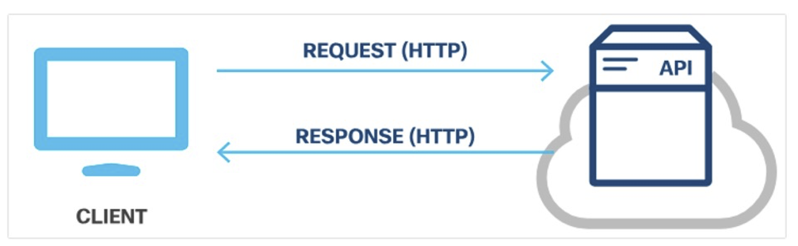
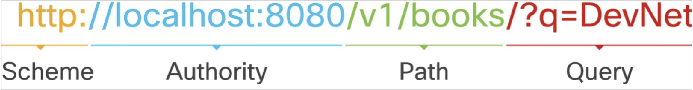
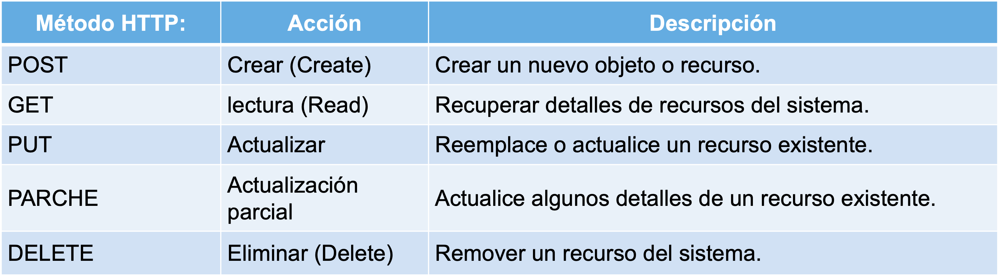
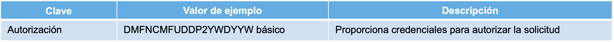
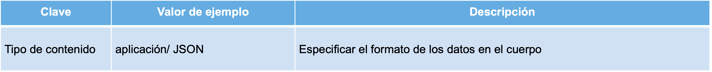
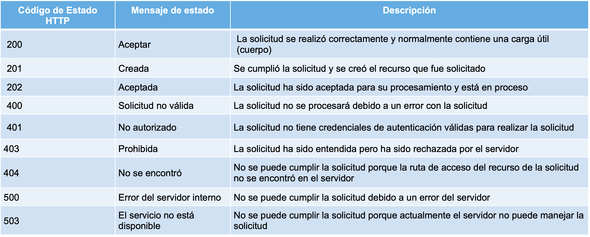
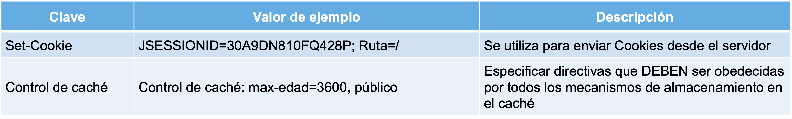
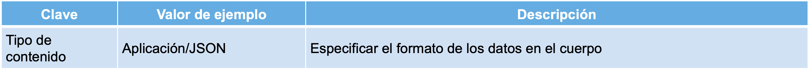
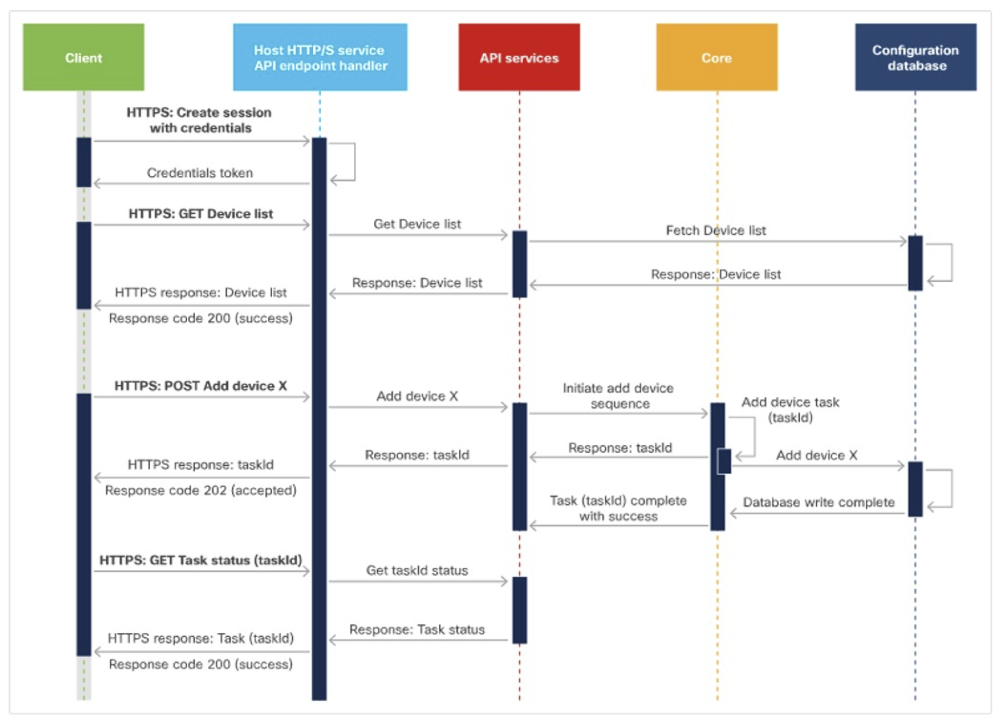

[Regresar](/Administracion-de-Sistemas-y-Servicios-en-Red/)

# Unidad 3: Tecnologías Web

# 🎯 **Objetivo de Aprendizaje**
Al finalizar la clase el estudiante será capaz de:
- Diseñar sitios web dinámicos y sus funciones para la administración de la información usando gestores de base de datos.

# 3.3 Métodos HTTP y operaciones CRUD
- [REST API](#rest)
    - [Solicitudes de API REST](#solicitudes)
    - [Respuestas API REST](#respuestas)
    - [Diagramas de secuencia con API REST](#diagramas)
    - [Mecanismos de autenticación](#autenticacion)
- [Webhoook](#webhook)

## 💻 REST API
- Transferencia de Estado Representacional (REST) es un estilo arquitectónico escrito por Roy Thomas Fielding.
- Roy ha establecido seis restricciones que se pueden aplicar a cualquier protocolo en REST.
- Una API de servicio web REST (API REST) es una interfaz de programación que se comunica a través de HTTP.
- Las API REST utilizan los mismos conceptos que el protocolo HTTP que son los siguientes:
  - Solicitudes/respuestas HTTP
  - Verbos HTTP
  - Código de estado HTTP
  - Encabezados/cuerpo HTTP

  

### 🕸️ Solicitudes de API REST
- Las solicitudes de API REST son solicitudes HTTP que son una forma de que una aplicación (cliente) pida al servidor que realice una función.
- Las solicitudes de API REST se componen de cuatro componentes principales:
  - Identificador uniforme de recursos (URI)
  - Método HTTP: 
    - Encabezado
    - Cuerpo

El identificador uniforme de recursos (URI), también conocido como localizador uniforme de recursos (URL), identifica qué recurso desea manipular el cliente. Los componentes de un URI son:
- Esquema: especifica qué protocolo HTTP se debe usar, http o https.
- Autoridad: consta de dos partes, a saber, host y puerto.
- Ruta de acceso: representa la ubicación del recurso, los datos u objeto, que se va a manipular en el servidor.
- Consulta: proporciona detalles adicionales sobre el ámbito, el filtrado o para aclarar una solicitud.

  

**Método HTTP**
- Las API REST utilizan los métodos HTTP estándar para comunicarse con los servicios web para los que se solicita la acción para el recurso dado.
- La asignación sugerida del método HTTP a la acción es la siguiente:

  

**Encabezado:**
• Los encabezados HTTP tienen el formato de pares nombre-valor separados por dos puntos (:), [nombre]: [valor]. 

**Dos tipos de encabezados:**
- Encabezados de solicitud : incluye información adicional que no esté relacionada con el contenido del mensaje.

  

Encabezados de entidad: información adicional que describe el contenido del cuerpo del mensaje.

  

**Cuerpo:**
- El cuerpo de la solicitud de API REST contiene los datos correspondientes al recurso que el cliente desee manipular.
- Las solicitudes de API REST que utilizan el método HTTP POST, PUT y PATCH suelen incluir un cuerpo.
- El cuerpo es opcional dependiendo del método HTTP.
- Si los datos se proporcionan en el cuerpo, entonces el tipo de datos debe especificarse en el encabezado mediante la clave de Content-Type.

### 🕸️ Respuestas API REST

- Las respuestas de la API REST son respuestas HTTP que comunica los resultados de la solicitud HTTP de un cliente.
- Respuesta REST API se componen de tres componentes principales: 
  - Estado HTTP
  - Encabezado
  - Cuerpo

**Estado HTTP**
- El código de estado HTTP ayuda al cliente a determinar el motivo del error y a veces puede proporcionar sugerencias para solucionar el problema.
- Los códigos de estado HTTP constan de tres dígitos, donde el primer dígito es la categoría de respuesta y los otros dos dígitos son asignados en orden numérico.
- Hay cinco categorías diferentes de códigos de estado HTTP:
  - **1xx — Informativo:** con fines informativos, las respuestas no contienen un cuerpo
  - **2xx — Éxito:** el servidor recibió y ha aceptado la solicitud
  - **3xx — Redirección:** el cliente tiene que tomar una acción adicional para completar la solicitud
  - **4xx — Error de cliente:** la solicitud contiene un error como sintáxis incorrecta o entrada no
válida
  - **5xx — Error del servidor:** no se pueden cumplir las solicitudes válidas.

Los códigos de estado HTTP comunes son los siguientes:

  

- **Encabezado:** El encabezado de la respuesta es proporcionar información adicional entre el servidor y el cliente en el formato de par nombre-valor que está separado por dos puntos ( : ), [nombre]: [valor] .Hay dos tipos de encabezados: encabezados de respuesta y encabezados de entidad.
  - **Encabezados de respuesta:** contiene información adicional que no está relacionada con el contenido del mensaje. Los encabezados de respuesta típicos para una solicitud de API REST incluyen:

  

  - **Encabezados de entidad:** Son información adicional que describe el contenido del cuerpo del mensaje. Un encabezado de entidad común especifica el tipo de datos que son devueltos:

  

**Paginación de respuestas**
- La paginación de respuestas permite dividir los datos en fragmentos.
- La mayoría de las API que implementan la paginación utilizan el parámetro de consulta para especificar qué
página devolver en la respuesta.

**Datos de respuesta comprimidos**
- Los datos comprimidos reducen la gran cantidad de datos que no se pueden paginar.
- Para solicitar una compresión de datos, la solicitud debe agregar el campo Accept-Encoding al encabezado de
solicitud. Los valores aceptados son:
  - gzip
  - Comprimir 
  - desinflar
  - br
  - identidad 
  - *

### 🕸️ Diagramas de secuencia con API REST

- Los diagramas de secuencia se utilizan para explicar una secuencia de intercambios o eventos.
- El diagrama de secuencia de solicitud de API tiene tres secuencias separadas:
  - **Crear sesión:**** la solicitud de inicio se etiqueta como HTTPS: Crear sesión con credenciales.
  - **Obtener dispositivos:** solicite una lista de dispositivos de la plataforma.
  - **Crear dispositivo:** empieza con una solicitud POST para crear un dispositivo.

  

### 🕸️ Mecanismos de autenticación

Los tipos comunes de mecanismos de autenticación incluyen:
- **Autenticación básica:** transmite credenciales como pares de nombre de usuario/contraseña
separados con dos puntos (:) y codificados usando Base64.
- **Autenticación al portador:** Utiliza un token al portador, que es una cadena generada por un
servidor de autenticación como un servicio de identidad (ID).
- **Clave API:** Es una cadena alfanumérica única generada por el servidor y asignada a un usuario. Los dos tipos de claves API son públicas y privadas.

## 💻 Webhoook](#)

- Un Webhook es una devolución de llamada HTTP, o un HTTP POST, a una URL especificada que notifica a la aplicación cuando se produce una actividad o evento en particular en los recursos.
- Con webhooks, las aplicaciones son más eficientes ya que no se requieren mecanismos de sondeo.
- Los webhooks también se conocen como API inversas, porque las aplicaciones se suscriben a un servidor webhook registrándose con el proveedor webhook.
- Varias aplicaciones pueden suscribirse a un único servidor webhook. 

***Ejemplos:***

    - La plataforma Cisco DNA Center proporciona webhooks que permiten a las aplicaciones de terceros recibir datos de red cuando se producen eventos especificados.
  - Puede crear un webhook para que Cisco Webex Teams le notifique de nuevos mensajes publicados en una sala en particular.

Los usos prácticos de los webhooks pueden incluir:
- Recordatorios automáticos diarios por correo electrónico para reuniones.
- Confirmaciones de pagos procesados y completados.
- Sincronización de cambios en los datos de clientes entre aplicaciones.

  

