[Regresar](/Administracion-de-Sistemas-y-Servicios-en-Red/)


# Unidad 4: 

# 🎯 **Objetivo de Aprendizaje**

Al finalizar la clase el estudiante será capaz de:

- Experimentar la gestión de servicios en red incluyendo servicios de Internet más usados  para el análisis de utilización de recursos computacionales que cumplan con  requerimientos específicos.


# 4.1 ¿Qué es Backend y Frontend?
- [Conceptos básicos](#conceptos)
- [Protocolo FTP](#ftp)
- [Protocolo DNS](#dns)
- [Protocolo SMTP - POP - IMAP](#correo)
- [Protocolo HTTP](#proxy)


# ¿Qué es Backend y Frontend?


<p align="center">
  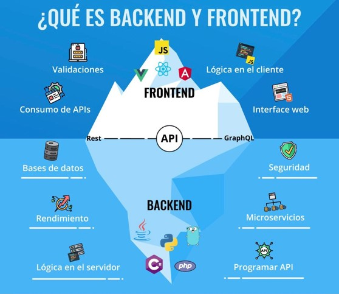
</p>

## Pre-requisitos HTML (Hypertext markup language)

+ HTML no es un lenguaje de programación. Es un lenguaje de marcado que le dice a los navegadores web cómo estructurar las páginas web que visita.

+ HTML consta de una serie de elementos que se utilizan para encerrar, envolver o marcar diferentes partes del contenido para que aparezca o actúe de una determinada manera.

+ Las etiquetas adjuntas pueden convertir el contenido en un hipervínculo para conectarse a otra página, poner palabras en cursiva, etc.

<p align="center">
  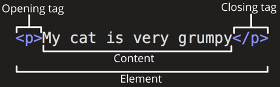
</p>

## Pre-requisitos CSS (Cascading stylesheets)

Se usa para darle estilos y diseño a la página web. Por ejemplo, puede usar CSS para modificar la fuente, el color, el tamaño y el espaciado de su contenido, dividirlo en varias columnas o agregar animaciones y otras características decorativas.

<p align="center">
  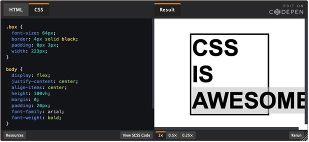
</p>

## Pre-requisitos JAVASCRIPT (JS)

+ JavaScript es un lenguaje dinámico de múltiples paradigmas con tipos y operadores, objetos estándar integrados y métodos. 

+ Su sintaxis se basa en los lenguajes Java y C; muchas estructuras de esos lenguajes también se aplican a JavaScript. 

+ JavaScript admite la programación orientada a objetos con prototipos de objetos, en lugar de clases.

<p align="center">
  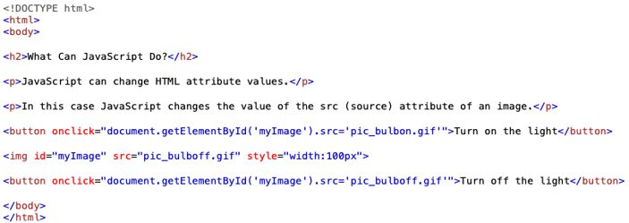
</p>

<p align="center">
  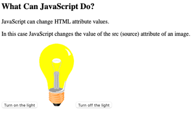
</p>

## Visual Studio Code

+ Editor de código fuente ligero.
+ Disponible para Windows, macOS y Linux.
+ Soporte integrado para JavaScript, + TypeScript y Node.js

<p align="center">
  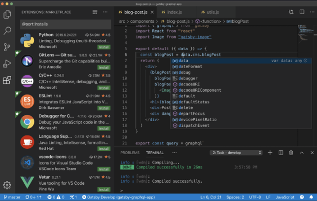
</p>


## Backend - Creación de API REST con NODE.JS


<p align="center">
  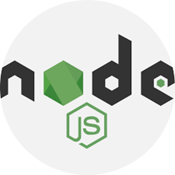
</p>

### ¿Qué es NODE.JS?

+ Entorno de ejecución de código en JavaScript para el servidor.
Asíncrono.
+ Con E/S de datos en una arquitectura orientada a eventos.
+ Basado en el motor  V8 de Google Chrome.

### ¿Cómo utilizar NODE.JS?

+ Uso de sockets.
+ Servidores locales o remotos.
+ Conexiones a bases de datos.
+ Creación de servicios REST.

### ¿Quién usa NODE.JS?

+ Netflix
+ PayPal
+ LinkedIn
+ Uber
+ Ebay

### EXPRESS

Es una infraestructura de aplicaciones web Node.js mínima y flexible que proporciona un conjunto sólido de características para las aplicaciones web y móviles.
Con miles de métodos de programa de utilidad HTTP y middleware a su disposición, la creación de una API sólida es rápida y sencilla.

<p align="center">
  
</p>

### Arquitectura de NODE.JS

+ package.json: Generalmente en la raíz del proyecto, contiene metadatos sobre su aplicación o modulo, así como la lista de dependencias.

+ NPM (Node Package Manager): Gestor de paquetes por defecto de Node.js. Ejecutando el commando npm install se pueden instalar estas dependencias y módulos.


<p align="center">
  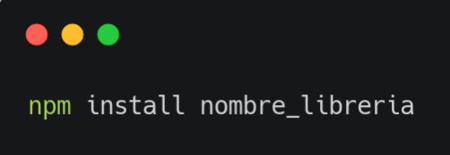
</p>

### Arquitectura de NODE.JS

Require: Es un función que incluye módulos que existen en archivos separados. Lee un archivo JavaScript, ejecuta el archivo y luego procede a devolver el objetivo exportado. Permite importar librerías propias de la arquitectura de Node, librerías externas y nuestros propios módulos. 

<p align="center">
  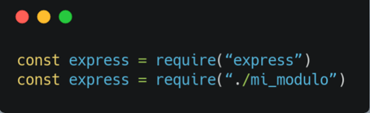
</p>

### Rutas del API en NODE.JS

En el código mostrado que se encuentra en la ruta ASSR>src>app.js se define el puerto, la ruta raíz del servidor web, que definen las rutas del API.
<p align="center">
  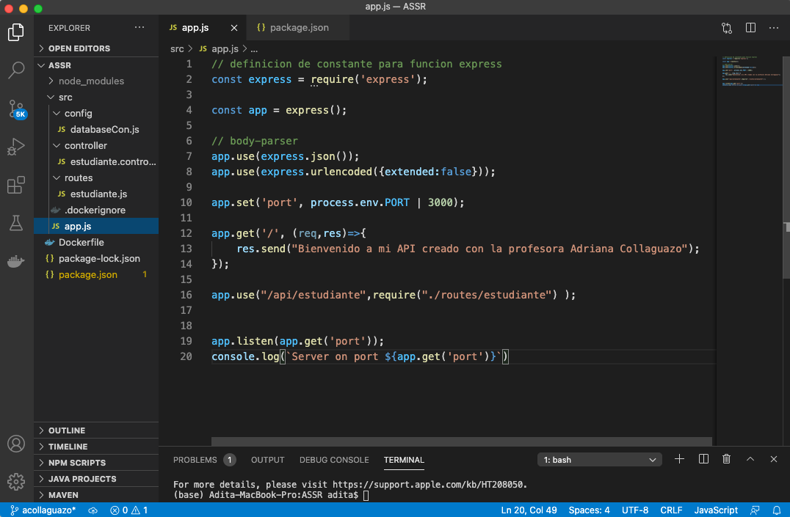
</p>

### Métodos GET, POST en NODE.JS

Definir en la ruta ASSR>src>controller>estudiante.controller.js los métodos GET, POST para el API.
<p align="center">
  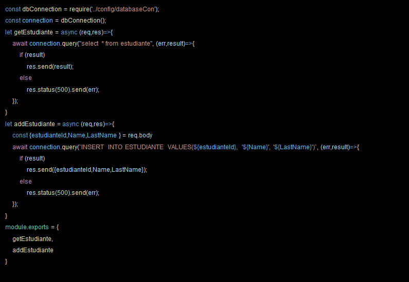
</p>

## Promesas
Las promesas nos brindan una forma de darle sentido al comportamiento asincrónico. 

Al realizar una solicitud asincrónica, puede suceder una de dos cosas: todo sale como esperamos o hay un error.

Las promesas facilitan el manejo de solicitudes asincrónicas, lo cual es bueno, porque tenemos que lidiar con muchos datos asincrónicos en JavaScript.

Por ejemplo: Creemos una promesa asincrónica para cargar datos desde la API randomuser.me. Esta API tiene información como dirección de correo electrónico, nombre, número de teléfono, ubicación, etc.

### Rutas del API en NODE.JS
Programar las rutas del API, en ASSR>src>routes>estudiante.js

<p align="center">
  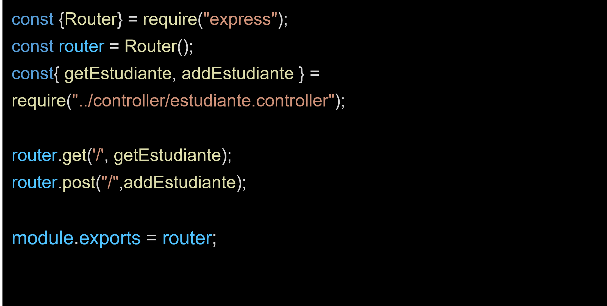
</p>

### Conexión a la base de datos MYSQL
Hacer la conexión a la base de MySQL con código JavaScript en la ruta ASSR>src>conf>databaseCon.js

<p align="center">
  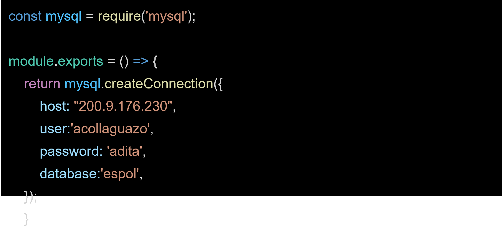
</p>

### Pruebas desde cliente WEB

<p align="center">
  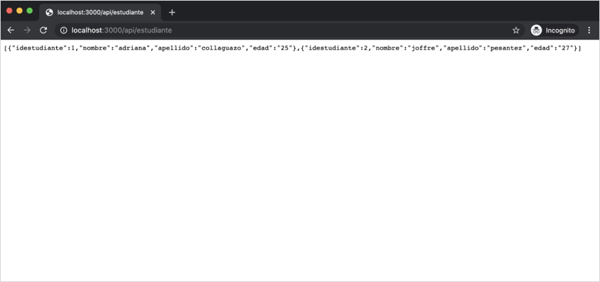
</p>

## Frontend -  Framework


<p align="left">
  
</p>

**Ember:** Es un framework más antiguo, tiene buena popularidad debido a su estabilidad, soporte de la comunidad y algunos principios de codificación inteligentes.

<p align="left">
  
</p>

**Angular:** Es un framework de aplica**ciones web y móviles de código abierto.
<p align="left">
  
</p>
**VUE:** Extiende HTML con algo de su propio código. Aparte de eso, se basa principalmente en JavaScript estándar y moderno.

<p align="left">
  
</p>

**REACT:** Es una biblioteca para renderizar componentes de UI. React se usa en combinación con otras bibliotecas para hacer aplicaciones web.

<p align="right">
  
</p>

## Frontend -  React

+ La creación de una aplicación React se trata de componentes.

+ Un componente individual de React se puede considerar como un componente de IU en una aplicación.

+ Los componentes de React son objetos reutilizables.

+ En React, la interfaz de usuario se expresa con funciones puras.

+ Escribe código que parece HTML directamente en su JavaScript.

### Hay tres formas de declarar componentes de React:

1. Como clases de ES6. Estas clases formalizan el patrón común de JavaScript.
```
¨¨ class HelloWorld extends React.Component { render() { return(<p>Hello, world!</p>) } } ¨¨
```

2. Importación y uso del método createReactClass ().

```
const IngredientsList = props => React.createElement("ul", {className: "ingredients"}, 
props.items.map((ingredient, i) => React.createElement("li", { key: i }, ingredient) ) ) 
```

3. Los componentes funcionales sin estado son funciones, no objetos que toman propiedades y devuelven un elemento DOM. El Modelo de objetos de documento (DOM) se refiere al árbol HTML del navegador que forma una página web.
```
const IngredientsList = props => React.createElement("ul", {className: "ingredients"}, 
props.items.map((ingredient, i) => React.createElement("li", { key: i }, ingredient) ) ) 
```
## Herramientas de desaroollo Web

<p align="center">
  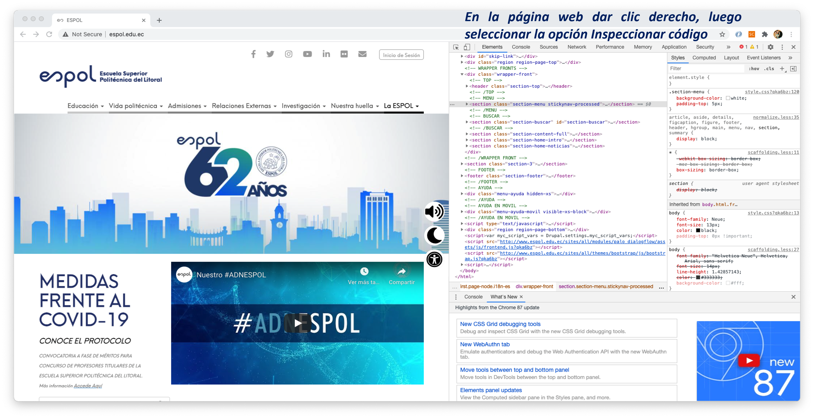
</p>


Código fuente de la página web: En una página web dar clic derecho, luego seleccionar la opción “Inspeccionar código fuente”.

**Bootstrap:** Es un marco CSS gratuito y de código abierto para el desarrollo web y móvil. Contiene plantillas de diseño basadas en CSS y JavaScript para tipografía, formularios, botones, navegación y otros componentes de la interfaz.

	https://getbootstrap.com


Documentación de código fuente para informes.

	https://carbon.now.sh
    


## Introducción a los sistemas de gestión de bases de datos.


<p align="center">
  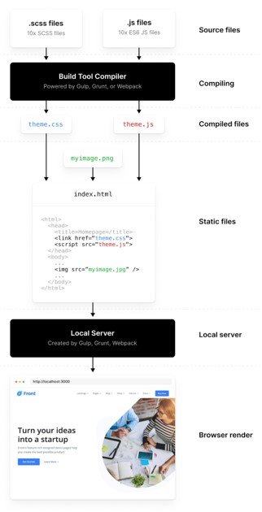
</p>

Hay una variedad de sistemas de administración de bases de datos disponibles para Linux. Estos incluyen sistemas de gestión de bases de datos de alto nivel comercial, como Oracle, DB2 de IBM y Sybase.
Las bases de datos de código abierto de Linux también están disponibles, como MySQL y PostgreSQL. Estos están entre los más utilizados en los sistemas Linux. La mayor parte de los sistemas de administración de base de datos disponibles para Linux, están diseñados para soportar grandes bases de datos relacionales.

## Estructura y diseño de base de datos relacional

MySQL y PostgreSQL utilizan una estructura de base de datos relacional. Esencialmente, esto significa que los datos se colocan en tablas, con campos identificadores utilizados para relacionar los datos con las entradas en otras tablas.

Cada fila de la tabla es un registro, cada uno con un identificador único, como un número de registro.

Una simple base de datos de una tabla no necesita un identificador único.

## Modelo lógico
### Modelo entidad / relación

Los elementos claves del modelo entidad-relación son entidades, atributos y relaciones.

**Entidad**: Es un objeto sobre el cual se requiere mantener o almacenar información. Ejemplos: facultad, alumno, materia, ciudad, item. Los tipos de entidades son: sujeto (empleado), objeto (articulo), evento (pedido), lugar (pais).

**Atributo:** Las entidades tienen atributos o propiedades, como a veces se les llama, que describen las características de la entidad. Por ejemplo: 

**Tipos de Atributos**
+ Clave primaria: #
+ Obligatorio: *
+ Opcional: O
+ Foráneo: F
+ Clave primaria foránea: F#

**Relaciones**
+ 1 : 1 
+ 1 : N
+ N : M
